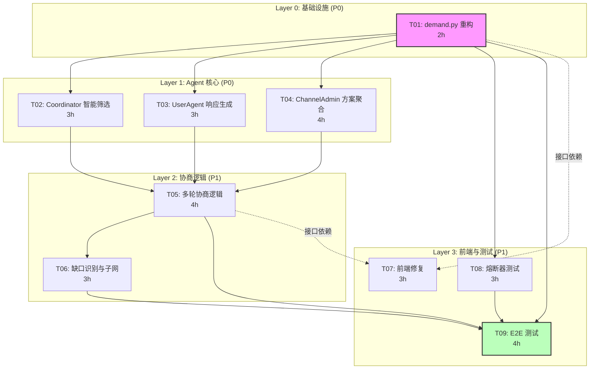

# PROJ-multiagent-negotiation-v3

> **文档路径**: `.ai/epic-multiagent-negotiation/PROJ-multiagent-negotiation-v3.md`
>
> * EPIC_ID: E-001
> * 版本: v3
> * 状态: ACTIVE
> * 创建日期: 2026-01-22
> * 最后更新: 2026-01-22 18:40 CST

---

## 1. Epic 概览

### 1.1 目标

将 Towow 多 Agent 协商系统从 Mock 硬编码模式升级为**真实 LLM 驱动**的智能协商，实现：

1. **真实需求理解**：通过 LLM 深度解析用户需求
2. **智能筛选**：基于 LLM 语义匹配候选 Agent
3. **多轮协商**：最多 3 轮协商达成共识
4. **缺口识别**：识别方案缺口并触发子网协作

### 1.2 范围

| 类型 | 内容 |
|------|------|
| **本期包含 (In Scope)** | T01-T09 共 9 个任务，覆盖后端重构、Agent 改造、前端修复、测试 |
| **本期不含 (Out of Scope)** | OpenAgent 网络真实部署、超过 1 层递归、超过 3 轮协商 |
| **依赖约束** | 依赖 Claude API (ANTHROPIC_API_KEY) |

### 1.3 关键交付物

| 交付物 | 描述 | 验收标准 |
|--------|------|----------|
| 需求提交 API | POST /api/v1/demand/submit | 真实 Agent 被触发，返回结构化理解 |
| 智能筛选 | Coordinator._smart_filter() | 返回 10-20 个语义匹配候选人 |
| 多轮协商 | ChannelAdmin 协商循环 | 3 轮内达成共识或生成妥协方案 |
| 前端展示 | NegotiationPage 实时更新 | SSE 事件正确渲染，无方案卡片消失 |
| E2E 测试 | 端到端测试脚本 | 80% 通过率 |

---

## 2. 任务清单与状态

### 2.1 Story -> Slice -> Task 对齐表

| Story ID | Story 名称 | Slice ID | Task ID | 本期纳入 | 优先级 |
|----------|-----------|----------|---------|---------|--------|
| STORY-01 | 需求理解集成 | SLICE-001 | T01 | Yes | P0 |
| STORY-02 | 智能筛选 | SLICE-001 | T02 | Yes | P0 |
| STORY-03 | UserAgent 响应 | SLICE-001 | T03 | Yes | P0 |
| STORY-04 | ChannelAdmin 聚合 | SLICE-001 | T04 | Yes | P0 |
| STORY-05 | 多轮协商 | SLICE-002 | T05 | Yes | P1 |
| STORY-06 | 缺口与子网 | SLICE-002 | T06 | Yes | P1 |
| STORY-07 | 前端修复 | SLICE-003 | T07 | Yes | P1 |
| STORY-04/05 | 熔断测试 | SLICE-002 | T08 | Yes | P1 |
| 全部 | E2E 测试 | SLICE-003 | T09 | Yes | P1 |

### 2.2 执行进度表

| TASK_ID | 任务名称 | 状态 | Owner | 预估工时 | 阻塞点 | Beads ID |
|---------|----------|------|-------|---------|--------|----------|
| T01 | demand.py 重构 | TODO | Dev A | 2h | - | towow-0bk |
| T02 | Coordinator 智能筛选 | TODO | Dev B | 3h | T01 | towow-t91 |
| T03 | UserAgent 响应生成 | TODO | Dev B | 3h | T01 | towow-ssp |
| T04 | ChannelAdmin 方案聚合 | TODO | Dev C | 4h | T01 | towow-697 |
| T05 | 多轮协商逻辑 | TODO | Dev A | 4h | T02,T03,T04 | towow-09c |
| T06 | 缺口识别与子网 | TODO | Dev A | 3h | T05 | towow-xzb |
| T07 | 前端修复 | TODO | Dev D | 3h | - (接口依赖) | towow-ibw |
| T08 | 熔断器测试 | TODO | QA | 3h | T01 | towow-ql9 |
| T09 | 端到端测试 | TODO | QA | 4h | T01,T05,T06,T08 | towow-83d |

**状态说明**：以 beads 为准（TODO/DOING/DONE）

---

## 3. 依赖关系图

### 3.1 Mermaid 依赖图



### 3.2 依赖类型说明

| 依赖类型 | 定义 | beads 设置 | 并行策略 |
|----------|------|-----------|---------|
| **硬依赖** | 代码直接 import 了其他任务的模块 | `bd dep add` 设置 | 必须等待 |
| **接口依赖** | 只需要调用接口，不依赖具体实现 | 不设置依赖 | 契约先行，可并行 |

### 3.3 硬依赖清单

| 被依赖任务 | 依赖它的任务 | 原因 |
|-----------|-------------|------|
| T01 | T02, T03, T04, T08 | T01 提供 demand API 调用入口 |
| T02, T03, T04 | T05 | T05 依赖三个 Agent 模块实现 |
| T05 | T06 | T06 在协商完成后触发 |
| T01, T05, T06, T08 | T09 | T09 需要完整后端流程 |

### 3.4 接口依赖清单（可并行）

| 任务 | 接口依赖 | 接口契约 | 验证时间点 |
|------|---------|---------|-----------|
| T07 | T01, T05 | SSE 事件结构、API 响应结构 | T01/T05 完成后立即联调 |

---

## 4. 里程碑计划

### 4.1 里程碑定义

| 里程碑 | 完成任务 | 目标日期 | 验收标准 |
|--------|----------|---------|---------|
| **M1: 基础联通** | T01 | +2h | 需求提交 API 可调用，真实 Agent 被触发 |
| **M2: Agent 核心** | T02, T03, T04 | +6h (M1后4h) | 单轮协商流程完成，生成初步方案 |
| **M3: 多轮协商** | T05 | +10h (M2后4h) | 3 轮协商完整运行，支持 negotiate 反馈 |
| **M4: 完整流程** | T06 | +13h (M3后3h) | 缺口识别和子网触发正常 |
| **M5: 前端可用** | T07 | +13h (并行) | 前端实时展示协商过程，无方案卡片消失 |
| **M6: 熔断验证** | T08 | +9h (M1后3h) | 熔断器正常触发，降级响应正确 |
| **M7: 测试通过** | T09 | +17h (M4后4h) | E2E 测试 80% 通过率 |

### 4.2 关键路径

```
关键路径: T01 (2h) -> T02 (3h) -> T05 (4h) -> T06 (3h) -> T09 (4h)
                   -> T03 (3h) /
                   -> T04 (4h) /
                   -> T08 (3h) -----------------> T09

关键路径总长: 16 小时
并行优化后预计: 17 小时（4-5 人团队）
```

### 4.3 并行开发策略

| 阶段 | 可并行任务 | 总工作量 | 并行后时间 |
|------|-----------|---------|-----------|
| 阶段 1 | T01 | 2h | 2h |
| 阶段 2 | T02, T03, T04, T08, T07(接口依赖) | 16h | 4h (5人并行) |
| 阶段 3 | T05 | 4h | 4h |
| 阶段 4 | T06 | 3h | 3h |
| 阶段 5 | T09 | 4h | 4h |

---

## 5. 风险登记表

| 风险 ID | 风险描述 | 影响级别 | 概率 | 缓解措施 | 责任人 |
|---------|----------|---------|------|---------|--------|
| R01 | LLM API 调用不稳定 | 高 | 中 | 熔断器 + 降级响应 (T08) | QA |
| R02 | 提示词效果不佳，协商质量差 | 中 | 中 | 提前准备多版本提示词，人工评估 | Dev A |
| R03 | 前后端接口不一致导致 T07 返工 | 中 | 低 | 接口契约文档化，提前联调 | Dev D |
| R04 | E2E 测试发现重大问题 | 高 | 中 | 预留 buffer，分阶段测试 | QA |
| R05 | Claude API 费用超预期 | 低 | 低 | 监控调用量，设置预算告警 | Dev A |

---

## 6. 验收标准

### 6.1 Gate A（进入实现前）- 已通过

- [x] PRD-multiagent-negotiation-v3.md 已完成
- [x] STORY-01 至 STORY-07 已定义
- [x] TECH-multiagent-negotiation-v3.md 已完成
- [x] TASK-dependency-analysis.md 已完成

### 6.2 Gate B（P0 Task 进入 DONE 前）

每个 P0 任务（T01-T04）完成前必须：

- [ ] 对应 AC 的测试用例与结果
- [ ] 单元测试覆盖率 >= 70%
- [ ] 代码 Review 通过
- [ ] 回写 TASK-*.md 验收记录

### 6.3 Gate C（里程碑验收）

| 里程碑 | 验收检查项 |
|--------|-----------|
| M1 | `curl POST /api/v1/demand/submit` 返回结构化响应 |
| M2 | 单轮协商生成方案，包含 assignments |
| M3 | 多轮协商完整运行，日志显示轮次变化 |
| M4 | 缺口识别日志，子网触发事件 |
| M5 | 前端无方案卡片消失，SSE 事件实时渲染 |
| M6 | 熔断器测试用例全部通过 |
| M7 | E2E 测试 80% 通过率 |

### 6.4 Mock 禁止检查点

- [ ] 前端是否调用真实后端 API？（Mock = 不通过）
- [ ] 后端是否返回真实 LLM 生成数据？（占位数据 = 不通过）
- [ ] 是否进行了真数据端到端验证？（没有 = 不通过）

---

## 7. beads 依赖设置命令清单

### 7.1 创建任务命令

```bash
# 创建 9 个任务
bd create "T01: demand.py 重构" -d "重构 demand.py，移除 mock，调用真实 Agent" -p 0 -e 120 -l "E-001,P0,backend"
bd create "T02: Coordinator 智能筛选" -d "激活 Coordinator._smart_filter() 中的 LLM 调用" -p 0 -e 180 -l "E-001,P0,backend,agent"
bd create "T03: UserAgent 响应生成" -d "激活 UserAgent._llm_generate_response()" -p 0 -e 180 -l "E-001,P0,backend,agent"
bd create "T04: ChannelAdmin 方案聚合" -d "激活 ChannelAdmin._generate_proposal()" -p 0 -e 240 -l "E-001,P0,backend,agent"
bd create "T05: 多轮协商逻辑" -d "实现多轮协商循环，最多 3 轮" -p 1 -e 240 -l "E-001,P1,backend,core"
bd create "T06: 缺口识别与子网" -d "实现缺口识别和子网触发" -p 1 -e 180 -l "E-001,P1,backend,core"
bd create "T07: 前端修复" -d "修复方案卡片消失、SSE 事件展示问题" -p 1 -e 180 -l "E-001,P1,frontend"
bd create "T08: 熔断器测试" -d "测试 LLMService 熔断器和降级响应" -p 1 -e 180 -l "E-001,P1,test"
bd create "T09: E2E 测试" -d "端到端测试，80% 通过率" -p 1 -e 240 -l "E-001,P1,test"
```

### 7.2 设置依赖命令（已执行）

```bash
# 语法：bd dep add <被阻塞任务> <阻塞它的任务>
# 已于 2026-01-22 18:40 执行完成

# T02, T03, T04, T08 依赖 T01
bd dep add towow-t91 towow-0bk  # T02 依赖 T01
bd dep add towow-ssp towow-0bk  # T03 依赖 T01
bd dep add towow-697 towow-0bk  # T04 依赖 T01
bd dep add towow-ql9 towow-0bk  # T08 依赖 T01

# T05 依赖 T02, T03, T04
bd dep add towow-09c towow-t91  # T05 依赖 T02
bd dep add towow-09c towow-ssp  # T05 依赖 T03
bd dep add towow-09c towow-697  # T05 依赖 T04

# T06 依赖 T05
bd dep add towow-xzb towow-09c  # T06 依赖 T05

# T09 依赖 T01, T05, T06, T08
bd dep add towow-83d towow-0bk  # T09 依赖 T01
bd dep add towow-83d towow-09c  # T09 依赖 T05
bd dep add towow-83d towow-xzb  # T09 依赖 T06
bd dep add towow-83d towow-ql9  # T09 依赖 T08

# 注意：T07 (towow-ibw) 是接口依赖，不设置硬依赖，可以与后端任务并行开发
```

### 7.3 Beads ID 映射表

| Task ID | Beads ID | 任务名称 |
|---------|----------|----------|
| T01 | towow-0bk | demand.py 重构 |
| T02 | towow-t91 | Coordinator 智能筛选 |
| T03 | towow-ssp | UserAgent 响应生成 |
| T04 | towow-697 | ChannelAdmin 方案聚合 |
| T05 | towow-09c | 多轮协商逻辑 |
| T06 | towow-xzb | 缺口识别与子网 |
| T07 | towow-ibw | 前端修复 |
| T08 | towow-ql9 | 熔断器测试 |
| T09 | towow-83d | E2E 测试 |

---

## 8. 接口依赖验证约定

### 8.1 T07 接口依赖验证

| 被依赖任务 | 接口依赖任务 | 验证状态 | 验证时间点 |
|-----------|-------------|---------|-----------|
| T01 | T07 | 待验证 | T01 完成后 |
| T05 | T07 | 待验证 | T05 完成后 |

### 8.2 接口契约

**T01 -> T07 契约**：
- POST /api/v1/demand/submit 响应结构
- SSE 事件类型和 payload 结构

**T05 -> T07 契约**：
- towow.negotiation.round_started 事件
- towow.proposal.distributed 事件
- towow.proposal.finalized 事件

---

## 9. 提交流程（生命线）

### 9.1 标准 dev 提交流程

```
1. 完成代码 + 更新 TASK 文档
2. 标记 beads 状态为 `DOING`
3. 停止！不要 commit！
4. 通知 proj 安排 tech review
5. 等待 tech review 通过
6. review 通过后，执行 Git Commit（引用 TASK-ID）
7. 标记 beads 状态为 `DONE`
```

### 9.2 违反流程的后果

- 代码需要重新 review
- 可能需要返工
- 不符合 DoD（Definition of Done）

---

## 10. 关联文档

| 文档类型 | 路径 |
|----------|------|
| PRD v3 | `.ai/epic-multiagent-negotiation/PRD-multiagent-negotiation-v3.md` |
| TECH v3 | `.ai/epic-multiagent-negotiation/TECH-multiagent-negotiation-v3.md` |
| 依赖分析 | `.ai/epic-multiagent-negotiation/TASK-dependency-analysis.md` |
| TASK 文档 | `.ai/epic-multiagent-negotiation/TASK-T*.md` |
| Story 文档 | `.ai/epic-multiagent-negotiation/STORY-*.md` |

---

## 11. 变更记录

| 版本 | 日期 | 修改人 | 修改内容 |
|------|------|--------|----------|
| v3 | 2026-01-22 18:40 | proj | 初版，基于 TECH v3 和依赖分析创建 |
| v3.1 | 2026-01-22 18:42 | proj | 创建 beads 任务并设置硬依赖关系 |
