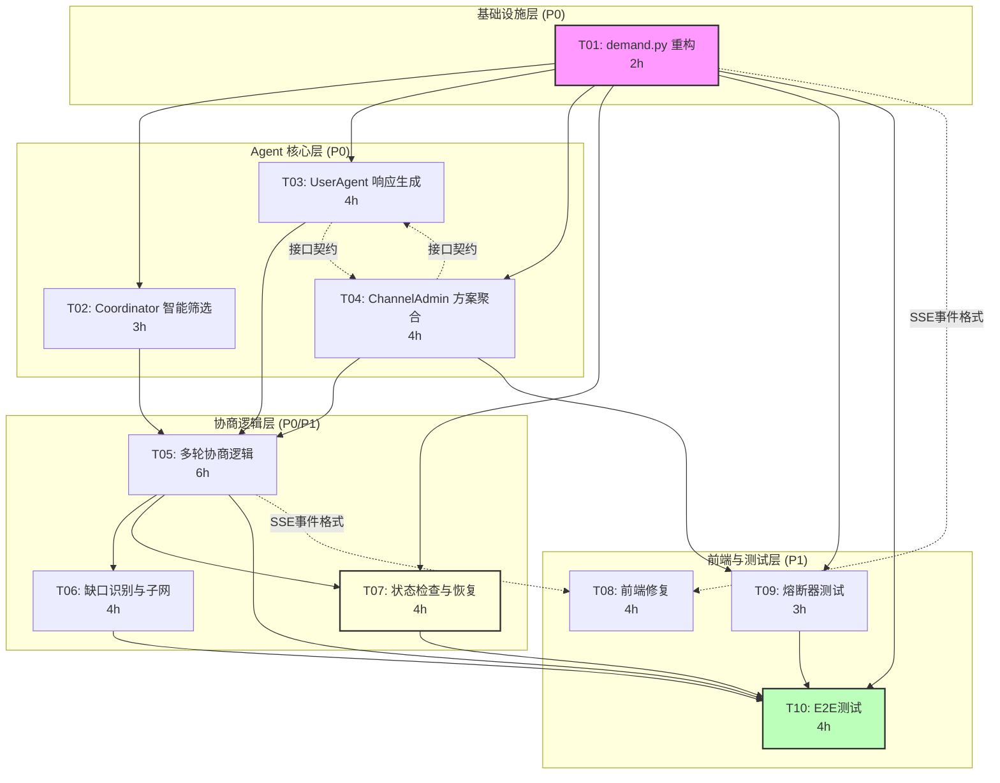

# PROJ-multiagent-negotiation-v4

> **文档路径**: `.ai/epic-multiagent-negotiation/PROJ-multiagent-negotiation-v4.md`
>
> * EPIC_ID: E-001
> * 版本: v4
> * 状态: ACTIVE
> * 创建日期: 2026-01-23
> * 最后更新: 2026-01-23 21:04 CST
> * 基于: TECH-multiagent-negotiation-v4.md, TASK-dependency-analysis.md (v4)

---

## 1. Epic 概览

### 1.1 目标

将 Towow 多 Agent 协商系统从 Mock 硬编码模式升级为**真实 LLM 驱动**的智能协商，实现：

1. **真实需求理解**：通过 LLM 深度解析用户需求
2. **智能筛选**：基于 LLM 语义匹配候选 Agent（保证至少 1 个候选）
3. **多轮协商**：**最多 5 轮**协商达成共识（v4 新增强制终结）
4. **缺口识别**：识别方案缺口并触发子网协作（1 层递归）
5. **状态检查**：（v4 新增）状态检查机制与幂等重试

### 1.2 v4 核心变更

| 变更项 | v3 状态 | v4 状态 | 技术影响 |
|--------|---------|---------|----------|
| 协商轮次 | 最多 3 轮 | **最多 5 轮，第 5 轮强制 finalize** | 修改 `MAX_NEGOTIATION_ROUNDS = 5` |
| 筛选失败处理 | 可能返回空列表 | **MVP 不允许筛选失败，兜底候选** | 优化提示词，添加兜底候选 |
| 候选上限 | 10-20 个 | **最多 10 个** | 修改 `MAX_CANDIDATES = 10` |
| 超时策略 | 简单超时 | **状态检查机制 + 重试** | 新增 `StateChecker` |
| 通过阈值 | majority | **>=80% finalize，50-80% 重协商，<50% fail** | 三档阈值逻辑 |
| 响应类型 | 单一类型 | **`response_type: "offer" | "negotiate"`** | 新增字段 |

### 1.3 范围

| 类型 | 内容 |
|------|------|
| **本期包含 (In Scope)** | T01-T10 共 10 个任务，覆盖后端重构、Agent 改造、状态检查、前端修复、测试 |
| **本期不含 (Out of Scope)** | OpenAgent 网络真实部署、超过 1 层递归、超过 5 轮协商 |
| **依赖约束** | 依赖 Claude API (ANTHROPIC_API_KEY) |

### 1.4 关键交付物

| 交付物 | 描述 | 验收标准 |
|--------|------|----------|
| 需求提交 API | POST /api/v1/demand/submit | 真实 Agent 被触发，返回结构化理解 |
| 智能筛选 | Coordinator._smart_filter() | 返回 1-10 个语义匹配候选人（保证不为空） |
| 多轮协商 | ChannelAdmin 协商循环 | **5 轮内**达成共识或强制终结 |
| 状态检查 | StateChecker 定期检查 | 发现异常触发恢复，幂等重试 |
| 前端展示 | NegotiationPage 实时更新 | SSE 事件正确渲染，支持 v4 新事件类型 |
| E2E 测试 | 端到端测试脚本 | 80% 通过率 |

---

## 2. 任务清单与状态

### 2.1 Story -> Slice -> Task 对齐表

| Story ID | Story 名称 | Slice ID | Task ID | 本期纳入 | 优先级 |
|----------|-----------|----------|---------|---------|--------|
| STORY-01 | 需求理解集成 | SLICE-001 | T01 | Yes | P0 |
| STORY-02 | 智能筛选 | SLICE-001 | T02 | Yes | P0 |
| STORY-03 | UserAgent 响应 | SLICE-001 | T03 | Yes | P0 |
| STORY-04 | ChannelAdmin 聚合 | SLICE-001 | T04 | Yes | P0 |
| STORY-05 | 多轮协商 | SLICE-002 | T05 | Yes | P0 |
| STORY-06 | 缺口与子网 | SLICE-002 | T06 | Yes | P1 |
| STORY-05 | 状态检查与恢复 | SLICE-002 | **T07 (v4新增)** | Yes | P1 |
| STORY-07 | 前端修复 | SLICE-003 | T08 | Yes | P1 |
| STORY-04/05 | 熔断测试 | SLICE-002 | T09 | Yes | P1 |
| 全部 | E2E 测试 | SLICE-003 | T10 | Yes | P1 |

### 2.2 执行进度表

| TASK_ID | 任务名称 | 状态 | Owner | 预估工时 | 阻塞点 | Beads ID |
|---------|----------|------|-------|---------|--------|----------|
| T01 | demand.py 重构 | TODO | Dev A | 2h | - | `towow-0bk` |
| T02 | Coordinator 智能筛选（保证>=1候选） | TODO | Dev B | 3h | T01 | `towow-t91` |
| T03 | UserAgent 响应生成（offer/negotiate） | TODO | Dev B | 4h | T01 | `towow-ssp` |
| T04 | ChannelAdmin 方案聚合 | TODO | Dev C | 4h | T01 | `towow-697` |
| T05 | 多轮协商逻辑（5轮+强制终结+阈值） | TODO | Dev A | 6h | T02,T03,T04 | `towow-09c` |
| T06 | 缺口识别与子网（1层递归） | TODO | Dev A | 4h | T05 | `towow-xzb` |
| **T07** | **状态检查与恢复机制 (v4新增)** | TODO | Dev A | 4h | T01,T05 | `towow-idn` |
| T08 | 前端修复（SSE 事件适配） | TODO | Dev D | 4h | - (接口依赖) | `towow-ibw` |
| T09 | 熔断器与降级测试 | TODO | QA | 3h | T01,T04 | `towow-ql9` |
| T10 | 端到端测试 | TODO | QA | 4h | T01,T05,T06,T07,T09 | `towow-83d` |

**状态说明**：以 beads 为准（TODO/DOING/DONE）

**总工时预估**: 38 小时
**并行开发预估**: 20 小时（4-5 人团队）

---

## 3. 依赖关系图

### 3.1 Mermaid 依赖图



### 3.2 依赖类型说明

| 依赖类型 | 定义 | beads 设置 | 并行策略 |
|----------|------|-----------|---------|
| **硬依赖** | 代码直接 import 了其他任务的模块 | `bd dep add` 设置 | 必须等待 |
| **接口依赖** | 只需要调用接口，不依赖具体实现 | 不设置依赖 | 契约先行，可并行 |

### 3.3 硬依赖清单

| 被依赖任务 | 依赖它的任务 | 原因 |
|-----------|-------------|------|
| T01 | T02, T03, T04, T07, T09 | T01 提供 demand API 调用入口 |
| T02, T03, T04 | T05 | T05 依赖三个 Agent 模块实现 |
| T05 | T06, T07 | 协商逻辑是后续功能的基础 |
| T01, T04 | T09 | 熔断器需要 LLM 调用点 |
| T01, T05, T06, T07, T09 | T10 | E2E 测试需要完整后端流程 |

### 3.4 接口依赖清单（可并行）

| 任务 | 接口依赖 | 接口契约 | 验证时间点 |
|------|---------|---------|-----------|
| T03, T04 | 互相依赖 | OfferResponseContract（响应格式） | 提前约定，并行开发 |
| T08 | T01, T05 | SSE 事件结构、API 响应结构 | T01/T05 完成后立即联调 |

---

## 4. 里程碑计划

### 4.1 里程碑定义

| 里程碑 | 完成任务 | 目标日期 | 验收标准 |
|--------|----------|---------|---------|
| **M1: 基础联通** | T01 | +2h | 需求提交 API 可调用，真实 Agent 被触发 |
| **M2: 单轮协商** | T02, T03, T04 | +6h (M1后4h) | 完成单轮协商流程，生成方案 |
| **M3: 多轮协商** | T05 | +12h (M2后6h) | **5 轮协商**完整运行，支持强制终结 |
| **M4: 完整流程** | T06 | +16h (M3后4h) | 缺口识别和子网触发正常 |
| **M5: 状态恢复** | T07 | +16h (M3后4h) | (v4新增) 状态检查与恢复机制正常 |
| **M6: 前端可用** | T08 | +12h (并行) | 前端实时展示协商过程，支持 v4 新事件 |
| **M7: 熔断验证** | T09 | +9h (M1后3h) | 熔断器正常触发，降级响应正确 |
| **M8: 测试通过** | T10 | +20h (M4后4h) | (v4新增) E2E 测试 80% 通过率 |

### 4.2 关键路径

```
关键路径: T01 (2h) → T02 (3h) → T05 (6h) → T06 (4h) → T10 (4h)
                   → T03 (4h) ↗
                   → T04 (4h) ↗
                   → T07 (4h) ──────────────────────────────↗

关键路径总长: 2 + 3 + 6 + 4 + 4 = 19 小时
备选路径: T01 → T09 → T10 = 2 + 3 + 4 = 9 小时（非关键）
```

### 4.3 并行开发策略

| 阶段 | 可并行任务 | 总工作量 | 并行后时间 |
|------|-----------|---------|-----------|
| 阶段 1 | T01 | 2h | 2h |
| 阶段 2 | T02, T03, T04, T08(部分) | 15h | 4h (4 人并行) |
| 阶段 3 | T05, T07, T09 | 13h | 6h (2 人并行) |
| 阶段 4 | T06 | 4h | 4h |
| 阶段 5 | T08(集成), T10 | 8h | 4h (2 人并行) |

**最短完成时间**: 2 + 4 + 6 + 4 + 4 = **20 小时**（理想情况）

---

## 5. 风险登记表

| 风险 ID | 风险描述 | 影响级别 | 概率 | 缓解措施 | 责任人 |
|---------|----------|---------|------|---------|--------|
| R01 | LLM API 调用不稳定 | 高 | 中 | 熔断器 + 降级响应 (T09) | QA |
| R02 | 提示词效果不佳，协商质量差 | 中 | 中 | 提前准备多版本提示词，人工评估 | Dev A |
| R03 | 前后端接口不一致导致 T08 返工 | 中 | 低 | 接口契约文档化，提前联调 | Dev D |
| R04 | E2E 测试发现重大问题 | 高 | 中 | 预留 buffer，分阶段测试 | QA |
| R05 | Claude API 费用超预期 | 低 | 低 | 监控调用量，设置预算告警 | Dev A |
| R06 | (v4新增) 状态检查机制误判 | 中 | 低 | 设置合理阈值，监控恢复日志 | Dev A |
| R07 | (v4新增) 5轮协商后仍无共识 | 中 | 中 | 强制终结生成妥协方案 | Dev A |

---

## 6. 验收标准

### 6.1 Gate A（进入实现前）- 已通过

- [x] PRD-multiagent-negotiation-v3.md 已完成
- [x] STORY-01 至 STORY-07 已定义
- [x] TECH-multiagent-negotiation-v4.md 已完成
- [x] TASK-dependency-analysis.md (v4) 已完成

### 6.2 Gate B（P0 Task 进入 DONE 前）

每个 P0 任务（T01-T05）完成前必须：

- [ ] 对应 AC 的测试用例与结果
- [ ] 单元测试覆盖率 >= 70%
- [ ] 代码 Review 通过
- [ ] 回写 TASK-*.md 验收记录

### 6.3 Gate C（里程碑验收）

| 里程碑 | 验收检查项 |
|--------|-----------|
| M1 | `curl POST /api/v1/demand/submit` 返回结构化响应 |
| M2 | 单轮协商生成方案，包含 assignments |
| M3 | **5 轮协商**完整运行，日志显示轮次变化，支持强制终结 |
| M4 | 缺口识别日志，子网触发事件（1 层递归） |
| M5 | (v4新增) 状态检查日志，异常恢复机制触发 |
| M6 | 前端无方案卡片消失，SSE 事件实时渲染，支持 v4 新事件 |
| M7 | 熔断器测试用例全部通过 |
| M8 | (v4新增) E2E 测试 80% 通过率 |

### 6.4 Mock 禁止检查点

- [ ] 前端是否调用真实后端 API？（Mock = 不通过）
- [ ] 后端是否返回真实 LLM 生成数据？（占位数据 = 不通过）
- [ ] 是否进行了真数据端到端验证？（没有 = 不通过）

---

## 7. beads 依赖设置命令清单

### 7.1 创建任务命令（T07 v4 新增）

```bash
# T07 已于 2026-01-23 21:04 创建
bd create "T07: 状态检查与恢复机制" -d "实现状态检查器（StateChecker），每5秒检查Channel状态，发现异常触发恢复，支持幂等重试。关联Story: STORY-05" -p 1 -e 240 -l "E-001-v4,P1,backend,core,状态检查"
# 结果: towow-idn
```

### 7.2 设置依赖命令（已执行）

```bash
# 语法：bd dep add <被阻塞任务> <阻塞它的任务>
# 已于 2026-01-23 21:04 执行完成

# === v3 已有依赖（无需重复执行）===
# T02, T03, T04 依赖 T01
bd dep add towow-t91 towow-0bk  # T02 依赖 T01
bd dep add towow-ssp towow-0bk  # T03 依赖 T01
bd dep add towow-697 towow-0bk  # T04 依赖 T01

# T05 依赖 T02, T03, T04
bd dep add towow-09c towow-t91  # T05 依赖 T02
bd dep add towow-09c towow-ssp  # T05 依赖 T03
bd dep add towow-09c towow-697  # T05 依赖 T04

# T06 依赖 T05
bd dep add towow-xzb towow-09c  # T06 依赖 T05

# === v4 新增依赖 ===
# T07 (状态检查) 依赖 T01, T05
bd dep add towow-idn towow-0bk  # T07 依赖 T01 ✓
bd dep add towow-idn towow-09c  # T07 依赖 T05 ✓

# T09 (熔断器测试) 依赖 T01, T04
bd dep add towow-ql9 towow-0bk  # T09 依赖 T01 (v3 已有)
bd dep add towow-ql9 towow-697  # T09 依赖 T04 ✓ (v4 新增)

# T10 依赖 T01, T05, T06, T07, T09
bd dep add towow-83d towow-0bk  # T10 依赖 T01 (v3 已有)
bd dep add towow-83d towow-09c  # T10 依赖 T05 (v3 已有)
bd dep add towow-83d towow-xzb  # T10 依赖 T06 (v3 已有)
bd dep add towow-83d towow-idn  # T10 依赖 T07 ✓ (v4 新增)
bd dep add towow-83d towow-ql9  # T10 依赖 T09 (v3 已有)

# 注意：T08 (towow-ibw) 是接口依赖，不设置硬依赖，可以与后端任务并行开发
```

### 7.3 Beads ID 映射表

| Task ID | Beads ID | 任务名称 | 优先级 | 状态 |
|---------|----------|----------|--------|------|
| T01 | `towow-0bk` | demand.py 重构 | P0 | open |
| T02 | `towow-t91` | Coordinator 智能筛选（保证>=1候选） | P0 | open |
| T03 | `towow-ssp` | UserAgent 响应生成（offer/negotiate） | P0 | open |
| T04 | `towow-697` | ChannelAdmin 方案聚合 | P0 | open |
| T05 | `towow-09c` | 多轮协商逻辑（5轮+强制终结+阈值） | P0 | open |
| T06 | `towow-xzb` | 缺口识别与子网（1层递归） | P1 | open |
| **T07** | `towow-idn` | **状态检查与恢复机制 (v4新增)** | P1 | open |
| T08 | `towow-ibw` | 前端修复（SSE 事件适配） | P1 | open |
| T09 | `towow-ql9` | 熔断器与降级测试 | P1 | open |
| T10 | `towow-83d` | 端到端测试 | P1 | open |

---

## 8. 接口依赖验证约定

### 8.1 T03 ↔ T04 接口契约

```typescript
// UserAgent 响应格式（T03 输出，T04 输入）
interface OfferResponseContract {
  type: "offer_response";
  channel_id: string;
  agent_id: string;
  display_name: string;
  response_type: "offer" | "negotiate";  // v4 新增
  decision: "participate" | "decline" | "conditional";
  contribution?: string;
  conditions?: string[];
  reasoning: string;
  decline_reason?: string;
  negotiation_points?: NegotiationPointContract[];  // v4 新增
  message_id: string;  // v4 新增，幂等
  timestamp: string;
}

interface NegotiationPointContract {
  aspect: string;
  current_value: string;
  desired_value: string;
  reason: string;
}
```

### 8.2 T01/T05 → T08 接口契约

```typescript
// SSE 事件格式（后端输出，前端输入）
interface SSEEventContract {
  event_id: string;
  event_type: string;
  timestamp: string;
  payload: Record<string, any>;
}

// v4 新增事件类型
type V4EventTypes =
  | "towow.feedback.evaluated"          // 反馈评估结果
  | "towow.negotiation.force_finalized" // 强制终结
  | "towow.negotiation.round_started";  // 新一轮开始

// 反馈评估事件 payload
interface FeedbackEvaluatedPayload {
  channel_id: string;
  accepts: number;
  rejects: number;
  negotiates: number;
  withdraws: number;
  accept_rate: number;  // 0-1
  round: number;
  decision: "finalize" | "renegotiate" | "fail";
}
```

### 8.3 接口依赖验证时间点

| 被依赖任务 | 接口依赖任务 | 验证状态 | 验证时间点 |
|-----------|-------------|---------|-----------|
| T03, T04 | 互相依赖 | 待验证 | T03/T04 完成后立即联调 |
| T01 | T08 | 待验证 | T01 完成后 |
| T05 | T08 | 待验证 | T05 完成后 |

---

## 9. 提交流程（生命线）

### 9.1 标准 dev 提交流程

```
1. 完成代码 + 更新 TASK 文档
2. 标记 beads 状态为 DOING
3. 停止！不要 commit！
4. 通知 proj 安排 tech review
5. 等待 tech review 通过
6. review 通过后，执行 Git Commit（引用 TASK-ID）
7. 标记 beads 状态为 DONE
```

### 9.2 违反流程的后果

- 代码需要重新 review
- 可能需要返工
- 不符合 DoD（Definition of Done）

### 9.3 标准 dev 调度指令模板

```markdown
@agent-dev

任务：TASK-XXX（user-op-hub-xxx）任务标题

【依赖状态】
✅ 上游任务已完成

【任务要求】
（具体任务描述）

【提交流程（重要！必须遵守）】

1. 完成代码 + 更新 TASK 文档
2. 标记 beads 状态为 DOING
3. 停止！不要 commit！
4. 通知 proj 安排 tech review
5. 等待 tech review 通过
6. review 通过后，执行 Git Commit（引用 TASK-ID）
7. 标记 beads 状态为 DONE

违反流程的后果：代码需要重新 review，可能需要返工

【输出】
1. 代码实现
2. 更新 TASK-XXX 文档
3. 自测验证
```

---

## 10. 执行计划（无限 AI Dev 场景）

### 10.1 第一批（立即可并行）

| 任务 | Beads ID | 说明 |
|------|----------|------|
| T01 | `towow-0bk` | 起始任务，无依赖 |
| T08 | `towow-ibw` | 接口依赖，可先行开发（契约先行） |

### 10.2 第二批（等 T01 完成）

| 任务 | Beads ID | 依赖 |
|------|----------|------|
| T02 | `towow-t91` | T01 |
| T03 | `towow-ssp` | T01 |
| T04 | `towow-697` | T01 |

### 10.3 第三批（等 T02/T03/T04 完成）

| 任务 | Beads ID | 依赖 |
|------|----------|------|
| T05 | `towow-09c` | T02, T03, T04 |
| T09 | `towow-ql9` | T01, T04 |

### 10.4 第四批（等 T05 完成）

| 任务 | Beads ID | 依赖 |
|------|----------|------|
| T06 | `towow-xzb` | T05 |
| T07 | `towow-idn` | T01, T05 |

### 10.5 第五批（等所有前置完成）

| 任务 | Beads ID | 依赖 |
|------|----------|------|
| T10 | `towow-83d` | T01, T05, T06, T07, T09 |

---

## 11. 关联文档

| 文档类型 | 路径 |
|----------|------|
| PRD v3 | `.ai/epic-multiagent-negotiation/PRD-multiagent-negotiation-v3.md` |
| TECH v4 | `.ai/epic-multiagent-negotiation/TECH-multiagent-negotiation-v4.md` |
| 依赖分析 v4 | `.ai/epic-multiagent-negotiation/TASK-dependency-analysis.md` |
| TASK 文档 | `.ai/epic-multiagent-negotiation/TASK-T*.md` |
| Story 文档 | `.ai/epic-multiagent-negotiation/STORY-*.md` |

---

## 12. 变更记录

| 版本 | 日期 | 修改人 | 修改内容 |
|------|------|--------|----------|
| v3 | 2026-01-22 18:40 | proj | 初版，基于 TECH v3 和依赖分析创建 |
| v4 | 2026-01-23 21:04 | proj | 基于 TECH v4 更新：5轮协商、新增 T07 状态检查、调整任务编号、更新依赖关系 |
