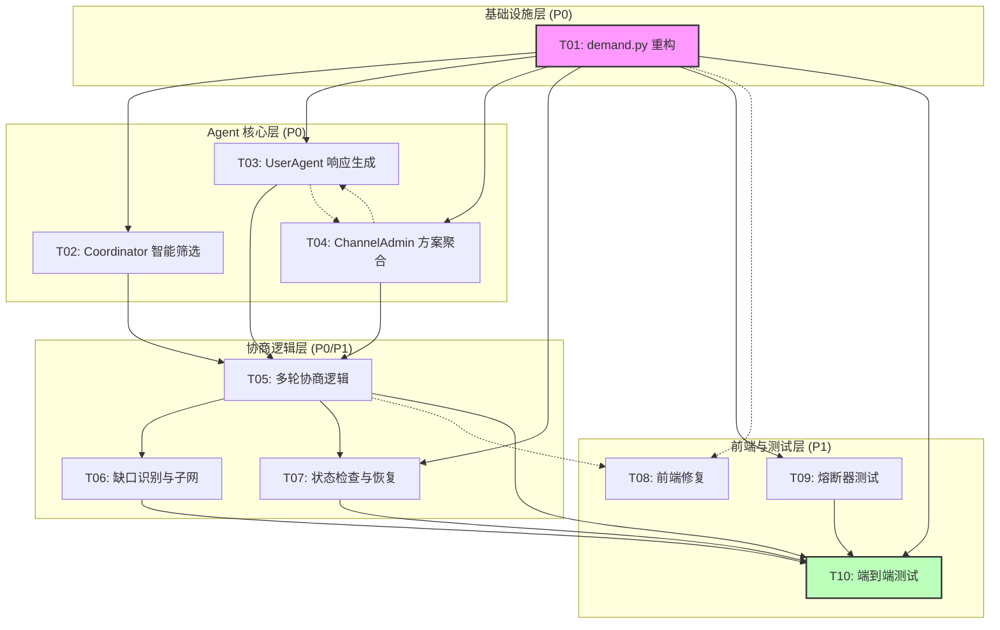

# 任务依赖分析

> **文档路径**: `.ai/epic-multiagent-negotiation/TASK-dependency-analysis.md`
>
> * EPIC_ID: E-001
> * 创建日期: 2026-01-22
> * 最后更新: 2026-01-23
> * 版本: v4（与 TECH-multiagent-negotiation-v4.md 对齐）

---

## 1. 依赖关系图

### 1.1 Mermaid 图



### 1.2 ASCII 图

```
                           ┌─────────────────────────────────────────────────────────────┐
                           │                    任务依赖关系图                             │
                           └─────────────────────────────────────────────────────────────┘

   Layer 0 (基础设施)        Layer 1 (Agent 核心)        Layer 2 (协商逻辑)        Layer 3 (前端/测试)
   ═══════════════════       ═════════════════════       ════════════════════       ══════════════════

                          ┌─────────────────┐
                          │ T02: Coordinator │
                 ┌───────▶│   智能筛选       │────────┐
                 │        └─────────────────┘        │
                 │                                    │
   ┌───────────────────┐                             │     ┌─────────────────┐
   │ T01: demand.py    │                             ├────▶│ T05: 多轮协商   │──────┐
   │     重构          │──┤                          │     │     逻辑        │      │
   └───────────────────┘  │                          │     └────────┬────────┘      │
          │               │ ┌─────────────────┐      │              │               │
          │               ├▶│ T03: UserAgent  │──────┤              ▼               │
          │               │ │   响应生成      │      │     ┌─────────────────┐      │
          │               │ └─────────────────┘      │     │ T06: 缺口识别   │      │
          │               │                          │     │   与子网        │──────┤
          │               │ ┌─────────────────┐      │     └─────────────────┘      │
          │               └▶│ T04: ChannelAdmin│─────┘                              │
          │                 │   方案聚合      │                                     │
          │                 └─────────────────┘                                     │
          │                                                                         │
          │                                         ┌─────────────────┐             │
          │                                         │ T07: 前端修复   │◀ - - - - - -│
          ├─ - - - - - - - - - - - - - - - - - - - ▶│                │             │
          │      (接口依赖)                         └─────────────────┘             │
          │                                                                         │
          │                                         ┌─────────────────┐             │
          └────────────────────────────────────────▶│ T08: 熔断器测试 │             │
                                                    │                 │─────────────┤
                                                    └─────────────────┘             │
                                                                                    │
                                                    ┌─────────────────┐             │
                                                    │ T09: E2E测试    │◀────────────┘
                                                    │                 │
                                                    └─────────────────┘

   图例:
   ───▶  硬依赖 (代码必须)
   - - ▶ 接口依赖 (可并行开发)
```

---

## 2. 硬依赖 vs 接口依赖

### 2.1 依赖类型定义

| 类型 | 定义 | 规则 |
|------|------|------|
| **硬依赖** | 代码直接 import 了其他任务的模块 | 必须等实现完成才能开始 |
| **接口依赖** | 只需要调用接口，不依赖具体实现 | 约定接口后可并行开发 |

### 2.2 详细依赖表

| 任务 | 硬依赖（必须先完成） | 接口依赖（约定接口后可并行） | 说明 |
|------|---------------------|---------------------------|------|
| **T01: demand.py 重构** | - | - | 起始任务，无依赖 |
| **T02: Coordinator 智能筛选** | T01 | - | 需要 T01 提供的调用入口 |
| **T03: UserAgent 响应生成** | T01 | T04（接口契约） | 响应格式需与 T04 对齐 |
| **T04: ChannelAdmin 方案聚合** | T01 | T03（接口契约） | 聚合逻辑依赖响应格式 |
| **T05: 多轮协商逻辑** | T02, T03, T04 | - | 需要完整的单轮流程 |
| **T06: 缺口识别与子网** | T05 | - | 需要协商完成后触发 |
| **T07: 状态检查与恢复** | T01, T05 | - | [v4新增] 需要状态机基础 |
| **T08: 前端修复** | - | T01, T05（SSE 事件格式） | 可并行开发 |
| **T09: 熔断器测试** | T01, T04 | - | 需要 LLM 调用点 |
| **T10: E2E 测试** | T01-T09 | - | [v4新增] 最终集成测试 |

### 2.3 接口契约定义

#### T01 → T07 接口契约

**POST /api/v1/demand/submit 响应结构**:
```typescript
interface SubmitDemandResponse {
  demand_id: string;
  channel_id: string;
  status: "processing" | "completed" | "failed";
  understanding: {
    surface_demand: string;
    deep_understanding: Record<string, any>;
    capability_tags: string[];
    context: Record<string, any>;
    confidence: "high" | "medium" | "low";
  };
}
```

**SSE 事件结构**:
```typescript
interface SSEEvent {
  event_id: string;
  event_type: string;
  timestamp: string;
  payload: Record<string, any>;
}

// 关键事件类型
type EventType =
  | "towow.demand.understood"
  | "towow.filter.completed"
  | "towow.offer.submitted"
  | "towow.proposal.distributed"
  | "towow.proposal.feedback"
  | "towow.negotiation.round_started"
  | "towow.proposal.finalized"
  | "towow.negotiation.failed"
  | "towow.agent.withdrawn";
// [v4新增] 事件类型
type V4EventType =
  | "towow.feedback.evaluated"        // 反馈评估结果
  | "towow.negotiation.force_finalized"  // 强制终结
  | "towow.negotiation.round_started";   // 新一轮开始
```

---

## 3. 关键路径分析

### 3.1 关键路径

```
T01 (2h) → T02 (3h) → T05 (6h) → T06 (4h) → T10 (4h)
         → T03 (4h) ↗
         → T04 (4h) ↗
         → T07 (4h) ──────────────────────────────↗

关键路径总长: 2 + 3 + 6 + 4 + 4 = 19 小时
备选路径: T01 → T09 → T10 = 2 + 3 + 4 = 9 小时（非关键）
```

### 3.2 并行度分析

| 阶段 | 可并行任务 | 总工作量 | 并行后时间 |
|------|-----------|---------|-----------|
| 阶段 1 | T01 | 2h | 2h |
| 阶段 2 | T02, T03, T04, T08(部分) | 15h | 4h (4 人并行) |
| 阶段 3 | T05, T07, T09 | 13h | 6h (2 人并行) |
| 阶段 4 | T06 | 4h | 4h |
| 阶段 5 | T08(集成), T10 | 8h | 4h (2 人并行) |

**最短完成时间**: 2 + 4 + 6 + 4 + 4 = **20 小时**（理想情况）

### 3.3 里程碑

| 里程碑 | 完成任务 | 验收标准 |
|--------|----------|----------|
| **M1: 基础联通** | T01 | 需求提交 API 可调用，真实 Agent 被触发 |
| **M2: 单轮协商** | T02, T03, T04 | 完成单轮协商流程，生成方案 |
| **M3: 多轮协商** | T05 | [v4] **5 轮协商**完整运行，支持强制终结 |
| **M4: 完整流程** | T06 | 缺口识别和子网触发正常 |
| **M5: 状态恢复** | T07 | [v4新增] 状态检查与恢复机制正常 |
| **M6: 前端可用** | T08 | 前端实时展示协商过程 |
| **M7: 熔断验证** | T09 | 熔断器正常触发，降级响应正确 |
| **M8: 测试通过** | T10 | [v4新增] E2E 测试 80% 通过率 |

---

## 4. 并行开发建议

### 4.1 开发分组建议

| 开发者 | 负责任务 | 技能要求 |
|--------|----------|----------|
| **Dev A (后端)** | T01, T05, T06 | Python, FastAPI, Agent 架构 |
| **Dev B (后端)** | T02, T03 | Python, LLM Prompt Engineering |
| **Dev C (后端)** | T04 | Python, LLM Prompt Engineering |
| **Dev D (前端)** | T07 | React, TypeScript, SSE |
| **QA** | T08 | E2E 测试, Python |

### 4.2 并行开发策略

```
Day 1:
  ├─ Dev A: T01 (demand.py 重构)
  └─ Dev D: T07 开始（基于接口契约）

Day 2:
  ├─ Dev A: T01 完成，开始 T05
  ├─ Dev B: T02 + T03 (并行开发)
  ├─ Dev C: T04
  └─ Dev D: T07 继续

Day 3:
  ├─ Dev A: T05 继续
  ├─ Dev B: T02 + T03 完成
  ├─ Dev C: T04 完成
  └─ Dev D: T07 完成

Day 4:
  ├─ Dev A: T05 完成，开始 T06
  └─ QA: T08 开始

Day 5:
  ├─ Dev A: T06 完成
  └─ QA: T08 完成
```

### 4.3 风险与缓解

| 风险 | 影响 | 缓解措施 |
|------|------|----------|
| LLM 调用不稳定 | T02-T04 阻塞 | 保留 mock fallback |
| 提示词效果不佳 | 协商质量差 | 提前准备多版本提示词 |
| 前后端接口不一致 | T07 返工 | 接口契约文档化，联调 |
| E2E 测试发现问题 | T08 延期 | 预留 buffer，分阶段测试 |

---

## 5. 任务清单汇总

| 任务 ID | 任务名称 | 关联 Story | 预估工时 | 优先级 |
|---------|----------|-----------|---------|--------|
| T01 | demand.py 重构 | STORY-01 | 2h | P0 |
| T02 | Coordinator 智能筛选（保证>=1候选） | STORY-02 | 3h | P0 |
| T03 | UserAgent 响应生成（offer/negotiate） | STORY-03 | 4h | P0 |
| T04 | ChannelAdmin 方案聚合 | STORY-04 | 4h | P0 |
| T05 | 多轮协商逻辑（5轮+强制终结+阈值） | STORY-05 | 6h | P0 |
| T06 | 缺口识别与子网（1层递归） | STORY-06 | 4h | P1 |
| T07 | 状态检查与恢复机制 | STORY-05 | 4h | P1 |
| T08 | 前端修复（SSE 事件适配） | STORY-07 | 4h | P1 |
| T09 | 熔断器与降级测试 | STORY-04/05 | 3h | P1 |
| T10 | 端到端测试 | 全部 | 4h | P1 |

**总工时预估**: 38 小时
**并行开发预估**: 20 小时（4-5 人团队）

---

## 6. 关联文档

| 文档类型 | 路径 |
|----------|------|
| 技术方案 v4 | `.ai/epic-multiagent-negotiation/TECH-multiagent-negotiation-v4.md` |
| TASK 文档 | `.ai/epic-multiagent-negotiation/TASK-T*.md` |
