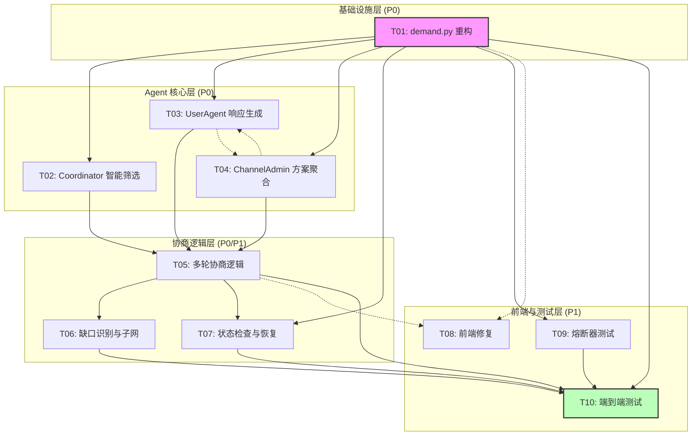

# TECH-multiagent-negotiation-v4

> **文档路径**: `.ai/epic-multiagent-negotiation/TECH-multiagent-negotiation-v4.md`
>
> * EPIC_ID: E-001
> * 版本: v4
> * 状态: DRAFT
> * 创建日期: 2026-01-23
> * 最后更新: 2026-01-23
> * 基于: PRD-multiagent-negotiation-v3.md, TECH-multiagent-negotiation-v3.md

---

## 变更概述

### v4 相对于 v3 的核心变更（PRD 分析结论）

| 变更项 | v3 状态 | v4 状态 | 技术影响 |
|--------|---------|---------|----------|
| 协商轮次 | 最多 3 轮 | **最多 5 轮，第 5 轮强制 finalize** | 修改 `MAX_NEGOTIATION_ROUNDS = 5`，增加强制终结逻辑 |
| 筛选失败处理 | 可能返回空列表 | **MVP 不允许筛选失败，提示词保证至少 1 个候选** | 优化提示词，添加兜底候选 |
| 候选上限 | 10-20 个 | **最多 10 个** | 修改 `MAX_CANDIDATES = 10` |
| 超时策略 | 简单超时 | **状态检查机制 + 重试** | 新增 `StateChecker`，幂等重试 |
| 通过阈值 | 全员 accept 或 majority | **>=80% accept → finalize，50-80% → 重协商，<50% → fail** | 明确三档阈值逻辑 |
| Offer vs Negotiate | 单一响应类型 | **`response_type: "offer" \| "negotiate"` 区分** | 新增 `response_type` 字段 |

---

## 1. 技术决策

### 1.1 协商轮次策略

```
[DECISION] 采用 5 轮协商 + 强制终结模式

实现：
- MAX_NEGOTIATION_ROUNDS = 5
- 第 1-4 轮：正常协商流程（有 negotiate 则继续）
- 第 5 轮后：强制 finalize
  - 已 accept 的 Agent → 确定参与者
  - 未 accept 的 Agent → 标记为"可选参与者"
  - 生成妥协方案，标注不完整部分
```

### 1.2 筛选失败策略

```
[DECISION] MVP 不允许筛选失败

实现：
1. 提示词优化：明确要求"必须返回至少 1 个候选人"
2. 兜底机制：
   - 若 LLM 返回空列表 → 重试一次（调整提示词）
   - 若仍然为空 → 返回随机 3 个活跃 Agent 作为兜底
3. 最终保证：任何需求都至少有 1 个候选人响应
```

### 1.3 超时与状态检查机制

```
[DECISION] 采用状态检查机制替代简单超时

理由：
1. 网络波动时，简单超时会误判
2. 状态检查可以捕获中间状态，支持恢复
3. 幂等重试避免重复处理

实现：
- StateChecker：每 5 秒检查 Channel 状态
- 发现异常状态 → 触发状态恢复
- 所有操作支持幂等（通过 message_id 去重）
```

### 1.4 通过阈值策略

```
[DECISION] 采用三档阈值机制

计算公式：accept_rate = 已接受数 / (已响应数 - 已退出数)

阈值判定：
- accept_rate >= 80%：进入 FINALIZED，生成最终方案
- 50% <= accept_rate < 80%：继续协商（若未达最大轮次）
- accept_rate < 50%：进入 FAILED，生成妥协方案
```

### 1.5 Offer vs Negotiate 响应类型

```
[DECISION] 用 response_type 区分响应意图

UserAgent 响应消息新增字段：
{
  "response_type": "offer" | "negotiate",
  "content": {...}
}

处理逻辑：
- offer：Agent 提交具体方案，进入正常聚合流程
- negotiate：Agent 希望讨价还价，附带修改建议
```

---

## 2. 架构设计

### 2.1 系统架构图

```
┌─────────────────────────────────────────────────────────────────────────┐
│                           Frontend (React + Zustand)                     │
│  ┌──────────────┐  ┌──────────────┐  ┌──────────────┐  ┌──────────────┐ │
│  │NegotiationPage│ │ EventTimeline │ │ ProposalCard  │ │CandidateList │ │
│  └───────┬──────┘  └───────┬──────┘  └───────┬──────┘  └───────┬──────┘ │
│          │                 │                 │                 │         │
│          └─────────────────┴─────────────────┴─────────────────┘         │
│                                    │                                      │
│                            SSE Stream (useSSE)                           │
└────────────────────────────────────┼─────────────────────────────────────┘
                                     │
                                     ▼
┌─────────────────────────────────────────────────────────────────────────┐
│                           Backend (FastAPI)                              │
│                                                                          │
│  ┌─────────────────────────────────────────────────────────────────┐    │
│  │                    API Layer (api/routers/)                      │    │
│  │  ┌──────────────┐  ┌──────────────┐  ┌──────────────┐           │    │
│  │  │ demand.py    │  │ events.py    │  │ admin.py     │           │    │
│  │  │ POST /submit │  │ GET /stream  │  │ Agent管理     │           │    │
│  │  └──────┬───────┘  └──────┬───────┘  └──────────────┘           │    │
│  └─────────┼─────────────────┼──────────────────────────────────────┘    │
│            │                 │                                           │
│            ▼                 ▼                                           │
│  ┌─────────────────────────────────────────────────────────────────┐    │
│  │                    Agent Layer (openagents/agents/)              │    │
│  │                                                                  │    │
│  │  ┌──────────────────────────────────────────────────────────┐   │    │
│  │  │                   Coordinator                             │   │    │
│  │  │  - 需求理解 (提示词1)                                      │   │    │
│  │  │  - 智能筛选 (提示词2) ← 保证至少1个候选                      │   │    │
│  │  │  - 创建 Channel                                           │   │    │
│  │  └──────────────────────────┬───────────────────────────────┘   │    │
│  │                             │                                    │    │
│  │              ┌──────────────┴──────────────┐                    │    │
│  │              ▼                              ▼                    │    │
│  │  ┌────────────────────┐        ┌────────────────────┐          │    │
│  │  │   ChannelAdmin     │        │   UserAgent (N个)   │          │    │
│  │  │  - 状态机驱动       │        │  - 响应生成          │          │    │
│  │  │  - 方案聚合         │        │  - offer/negotiate  │          │    │
│  │  │  - 阈值判定         │        │  - 方案反馈          │          │    │
│  │  │  - 强制终结(第5轮)  │        │  - 退出协商          │          │    │
│  │  │  - 状态检查         │        └────────────────────┘          │    │
│  │  │  - 缺口识别         │                                         │    │
│  │  │  - 子网递归(1层)    │                                         │    │
│  │  └────────────────────┘                                         │    │
│  └─────────────────────────────────────────────────────────────────┘    │
│                                                                          │
│  ┌─────────────────────────────────────────────────────────────────┐    │
│  │                    Service Layer (services/)                     │    │
│  │  ┌──────────────┐  ┌──────────────┐  ┌──────────────┐           │    │
│  │  │ llm.py       │  │ state_checker│  │ gap_*.py     │           │    │
│  │  │ 熔断+降级     │  │ 状态检查机制  │  │ 缺口识别      │           │    │
│  │  └──────────────┘  └──────────────┘  └──────────────┘           │    │
│  └─────────────────────────────────────────────────────────────────┘    │
│                                                                          │
│  ┌─────────────────────────────────────────────────────────────────┐    │
│  │                    Event Layer (events/)                         │    │
│  │  ┌──────────────┐  ┌──────────────┐                             │    │
│  │  │ recorder.py  │  │ bus.py       │                             │    │
│  │  │ 事件记录      │  │ 事件总线      │                             │    │
│  │  └──────────────┘  └──────────────┘                             │    │
│  └─────────────────────────────────────────────────────────────────┘    │
└─────────────────────────────────────────────────────────────────────────┘
```

### 2.2 模块职责

| 组件 | 职责 | 关键配置 |
|------|------|----------|
| **Coordinator** | 需求理解、智能筛选（保证>=1候选）、创建 Channel | `MAX_CANDIDATES = 10` |
| **ChannelAdmin** | 状态机、聚合方案、阈值判定、强制终结、状态检查 | `MAX_ROUNDS = 5`, `ACCEPT_THRESHOLD = 0.8` |
| **UserAgent** | 响应生成（offer/negotiate）、方案反馈、退出 | `response_type` 字段 |
| **StateChecker** | 定期检查 Channel 状态、触发恢复、幂等重试 | `CHECK_INTERVAL = 5s` |
| **LLMService** | 熔断降级、预设降级响应 | `FAILURE_THRESHOLD = 3` |

---

## 3. 接口契约

### 3.1 REST API 接口

#### 3.1.1 POST /api/v1/demand/submit

**请求**:
```json
{
  "raw_input": "我想在北京办一场AI主题聚会，需要场地和嘉宾",
  "user_id": "user_alice"
}
```

**响应**:
```json
{
  "demand_id": "d-abc12345",
  "channel_id": "collab-abc12345",
  "status": "processing",
  "understanding": {
    "surface_demand": "想在北京办一场AI主题聚会",
    "deep_understanding": {
      "motivation": "上个月参加聚会后很兴奋，想当组织者",
      "likely_preferences": ["轻松氛围", "质量优先"]
    },
    "capability_tags": ["场地提供", "演讲嘉宾", "活动策划"],
    "context": {
      "location": "北京"
    },
    "confidence": "high"
  }
}
```

**错误响应**:
```json
{
  "error_code": "E001",
  "message": "需求格式错误",
  "details": "raw_input 不能为空"
}
```

#### 3.1.2 GET /api/v1/events/negotiations/{demand_id}/stream

**协议**: Server-Sent Events (SSE)

**Headers**:
```
Content-Type: text/event-stream
Cache-Control: no-cache
Connection: keep-alive
```

**事件格式**:
```
event: towow.offer.submitted
data: {"event_id":"evt-abc123","event_type":"towow.offer.submitted","timestamp":"2026-01-22T10:05:00Z","payload":{...}}

event: towow.feedback.evaluated
data: {"event_id":"evt-abc124","event_type":"towow.feedback.evaluated","timestamp":"2026-01-22T10:10:00Z","payload":{"accepts":3,"rejects":1,"negotiates":1,"accept_rate":0.6,"round":2}}

```

### 3.2 Agent 间消息接口

#### 3.2.1 Coordinator → ChannelAdmin: create_channel

```typescript
interface CreateChannelMessage {
  type: "create_channel";
  demand_id: string;
  channel_id: string;
  demand: {
    surface_demand: string;
    deep_understanding: Record<string, any>;
    capability_tags: string[];
    context: Record<string, any>;
  };
  candidates: Array<{
    agent_id: string;
    display_name: string;
    reason: string;          // 被筛选原因
    relevance_score: number; // 0-100
  }>;
}
```

#### 3.2.2 ChannelAdmin → UserAgent: demand_offer

```typescript
interface DemandOfferMessage {
  type: "demand_offer";
  channel_id: string;
  demand_id: string;
  demand: DemandUnderstanding;
  round: number;             // 当前轮次
  filter_reason: string;     // 为什么被邀请
  match_score: number;       // 匹配度
}
```

#### 3.2.3 UserAgent → ChannelAdmin: offer_response

```typescript
interface OfferResponseMessage {
  type: "offer_response";
  channel_id: string;
  agent_id: string;
  display_name: string;
  response_type: "offer" | "negotiate";  // [v4新增] 响应类型
  decision: "participate" | "decline" | "conditional";
  contribution?: string;      // 贡献描述（offer 时必填）
  conditions?: string[];      // 条件列表
  reasoning: string;          // 决策理由
  decline_reason?: string;    // 拒绝原因
  negotiation_points?: Array<{  // [v4新增] 协商要点（negotiate 时必填）
    aspect: string;           // 协商方面
    current_value: string;    // 当前值
    desired_value: string;    // 期望值
    reason: string;           // 原因
  }>;
  message_id: string;         // [v4新增] 消息ID，用于幂等
}
```

#### 3.2.4 ChannelAdmin → UserAgent: proposal_review

```typescript
interface ProposalReviewMessage {
  type: "proposal_review";
  channel_id: string;
  demand_id: string;
  proposal: Proposal;
  round: number;
  max_rounds: number;         // 最大轮次（5）
  your_assignment?: Assignment;
}
```

#### 3.2.5 UserAgent → ChannelAdmin: proposal_feedback

```typescript
interface ProposalFeedbackMessage {
  type: "proposal_feedback";
  channel_id: string;
  agent_id: string;
  feedback_type: "accept" | "negotiate" | "withdraw";
  adjustment_request?: string;  // negotiate 时的调整请求
  reasoning: string;
  message_id: string;           // [v4新增] 消息ID，用于幂等
}
```

### 3.3 SSE 事件类型（完整）

```typescript
// 需求处理阶段
interface DemandUnderstoodEvent {
  event_type: "towow.demand.understood";
  payload: {
    demand_id: string;
    surface_demand: string;
    capability_tags: string[];
    confidence: "high" | "medium" | "low";
  };
}

// 筛选阶段
interface FilterCompletedEvent {
  event_type: "towow.filter.completed";
  payload: {
    demand_id: string;
    channel_id: string;
    candidates_count: number;  // 最多10个
    candidates: Array<{
      agent_id: string;
      display_name: string;
      reason: string;
    }>;
  };
}

// Channel 创建
interface ChannelCreatedEvent {
  event_type: "towow.channel.created";
  payload: {
    channel_id: string;
    demand_id: string;
    participants_count: number;
  };
}

// 响应提交（区分 offer/negotiate）
interface OfferSubmittedEvent {
  event_type: "towow.offer.submitted";
  payload: {
    channel_id: string;
    demand_id: string;
    agent_id: string;
    display_name: string;
    response_type: "offer" | "negotiate";  // [v4新增]
    decision: "participate" | "decline" | "conditional";
    contribution?: string;
    negotiation_summary?: string;  // negotiate 时的摘要
  };
}

// 反馈评估完成（[v4新增]）
interface FeedbackEvaluatedEvent {
  event_type: "towow.feedback.evaluated";
  payload: {
    channel_id: string;
    accepts: number;
    rejects: number;
    negotiates: number;
    withdraws: number;
    accept_rate: number;  // 0-1
    round: number;
    decision: "finalize" | "renegotiate" | "fail";
  };
}

// 新一轮协商
interface RoundStartedEvent {
  event_type: "towow.negotiation.round_started";
  payload: {
    channel_id: string;
    demand_id: string;
    round: number;
    max_rounds: number;  // 5
    reason: string;      // 为什么进入新一轮
  };
}

// 强制终结（[v4新增]）
interface ForceFinalizedEvent {
  event_type: "towow.negotiation.force_finalized";
  payload: {
    channel_id: string;
    demand_id: string;
    confirmed_participants: string[];    // 已确认参与者
    optional_participants: string[];     // 可选参与者（未accept）
    rounds_taken: number;                // 5
    final_proposal: Proposal;
  };
}

// 协商失败
interface NegotiationFailedEvent {
  event_type: "towow.negotiation.failed";
  payload: {
    channel_id: string;
    demand_id: string;
    reason: "low_acceptance" | "no_participants" | "max_rounds_exceeded" | "timeout";
    accept_rate: number;
    last_proposal?: Proposal;
    compromise_suggestion?: string;  // 妥协建议
  };
}
```

---

## 4. 数据模型

### 4.1 核心数据结构

#### 4.1.1 ChannelState（状态管理）

```python
@dataclass
class ChannelState:
    """Channel 完整状态"""
    channel_id: str
    demand_id: str
    status: ChannelStatus

    # 基础信息
    demand_data: Dict[str, Any]
    candidates: List[Dict[str, Any]]  # 最多10个

    # 响应收集
    responses: Dict[str, OfferResponse]      # agent_id -> response
    expected_responses: Set[str]

    # 提案相关
    current_proposal: Optional[Proposal]
    proposal_version: int = 1

    # 反馈收集
    feedback: Dict[str, ProposalFeedback]    # agent_id -> feedback

    # 协商轮次
    current_round: int = 1
    max_rounds: int = 5                       # [v4] 最大5轮

    # 统计信息
    accept_count: int = 0
    reject_count: int = 0
    negotiate_count: int = 0
    withdraw_count: int = 0

    # 子网相关
    parent_channel_id: Optional[str] = None
    depth: int = 0
    subnet_ids: List[str] = field(default_factory=list)

    # 幂等控制
    processed_message_ids: Set[str] = field(default_factory=set)

    # 时间戳
    created_at: str
    last_updated_at: str

    # 状态检查
    last_state_check: str
    recovery_attempts: int = 0
    max_recovery_attempts: int = 3
```

#### 4.1.2 OfferResponse（响应）

```python
@dataclass
class OfferResponse:
    """Agent 响应"""
    offer_id: str
    agent_id: str
    display_name: str
    demand_id: str

    response_type: Literal["offer", "negotiate"]  # [v4新增]
    decision: Literal["participate", "decline", "conditional"]

    # offer 相关
    contribution: Optional[str] = None
    conditions: List[str] = field(default_factory=list)

    # negotiate 相关
    negotiation_points: List[NegotiationPoint] = field(default_factory=list)

    reasoning: str = ""
    decline_reason: Optional[str] = None
    confidence: int = 0  # 0-100

    message_id: str = ""  # 幂等ID
    submitted_at: str = ""

@dataclass
class NegotiationPoint:
    """协商要点"""
    aspect: str           # 协商方面
    current_value: str    # 当前值
    desired_value: str    # 期望值
    reason: str           # 原因
```

#### 4.1.3 Proposal（方案）

```python
@dataclass
class Proposal:
    """协商方案"""
    proposal_id: str
    demand_id: str
    version: int                        # 1-5

    summary: str
    objective: str
    assignments: List[Assignment]
    timeline: Timeline
    rationale: str

    # 状态信息
    is_forced: bool = False            # [v4] 是否强制终结
    confirmed_participants: List[str] = field(default_factory=list)
    optional_participants: List[str] = field(default_factory=list)

    # 缺口
    gaps: List[Gap] = field(default_factory=list)

    confidence: Literal["high", "medium", "low"] = "medium"
    created_at: str = ""

@dataclass
class Assignment:
    """角色分配"""
    agent_id: str
    display_name: str
    role: str
    responsibility: str
    dependencies: List[str] = field(default_factory=list)
    is_confirmed: bool = True          # [v4] 是否已确认
    notes: str = ""
```

---

## 5. 状态机设计

### 5.1 ChannelStatus 状态枚举

```python
class ChannelStatus(Enum):
    CREATED = "created"               # 已创建
    BROADCASTING = "broadcasting"     # 正在广播邀请
    COLLECTING = "collecting"         # 收集响应中
    AGGREGATING = "aggregating"       # 聚合方案中
    PROPOSAL_SENT = "proposal_sent"   # 方案已分发
    NEGOTIATING = "negotiating"       # 协商中
    FINALIZED = "finalized"           # 成功完成
    FORCE_FINALIZED = "force_finalized"  # [v4] 强制终结
    FAILED = "failed"                 # 失败
```

### 5.2 状态转换图

```
┌─────────────────────────────────────────────────────────────────────────────┐
│                         Channel 状态机 (v4)                                   │
│                                                                              │
│   ┌──────────┐                                                               │
│   │ CREATED  │                                                               │
│   └────┬─────┘                                                               │
│        │ start_managing()                                                    │
│        ▼                                                                     │
│   ┌──────────────┐                                                           │
│   │ BROADCASTING │                                                           │
│   └────┬─────────┘                                                           │
│        │ 广播完成                                                             │
│        ▼                                                                     │
│   ┌──────────────┐      超时且无响应                                          │
│   │ COLLECTING   │────────────────────────────────────────┐                  │
│   └────┬─────────┘                                        │                  │
│        │ 响应收集完成/超时(有响应)                           │                  │
│        ▼                                                  │                  │
│   ┌──────────────┐                                        │                  │
│   │ AGGREGATING  │                                        │                  │
│   └────┬─────────┘                                        │                  │
│        │ 聚合完成                                          │                  │
│        ▼                                                  │                  │
│   ┌────────────────┐                                      │                  │
│   │ PROPOSAL_SENT  │                                      │                  │
│   └────┬───────────┘                                      │                  │
│        │ 方案分发完成                                       │                  │
│        ▼                                                  │                  │
│   ┌──────────────┐                                        │                  │
│   │ NEGOTIATING  │◄──────────────────────────────┐        │                  │
│   └────┬─────────┘                               │        │                  │
│        │                                         │        │                  │
│   ┌────┴────────────────┬────────────────────┐   │        │                  │
│   │                     │                    │   │        │                  │
│   ▼                     ▼                    ▼   │        ▼                  │
│ accept_rate >= 80%  50% <= rate < 80%   rate < 50%        ┌──────────┐       │
│   │                     │ && round < 5       │            │  FAILED  │       │
│   │                     │                    │            └──────────┘       │
│   │                     ▼                    │                               │
│   │            ┌──────────────┐              │                               │
│   │            │ 重新协商      │──────────────┘                               │
│   │            │ round++      │                                              │
│   │            └──────┬───────┘                                              │
│   │                   │ round == 5                                           │
│   │                   ▼                                                      │
│   │            ┌──────────────────┐                                          │
│   │            │ FORCE_FINALIZED  │ ← [v4新增] 第5轮强制终结                    │
│   │            └──────────────────┘                                          │
│   │                                                                          │
│   ▼                                                                          │
│ ┌──────────────┐                                                             │
│ │  FINALIZED   │                                                             │
│ └──────────────┘                                                             │
│                                                                              │
└─────────────────────────────────────────────────────────────────────────────┘
```

### 5.3 状态转换规则

```python
VALID_TRANSITIONS = {
    ChannelStatus.CREATED: {
        ChannelStatus.BROADCASTING,
        ChannelStatus.FAILED
    },
    ChannelStatus.BROADCASTING: {
        ChannelStatus.COLLECTING,
        ChannelStatus.FAILED
    },
    ChannelStatus.COLLECTING: {
        ChannelStatus.AGGREGATING,
        ChannelStatus.FAILED  # 无响应
    },
    ChannelStatus.AGGREGATING: {
        ChannelStatus.PROPOSAL_SENT,
        ChannelStatus.FAILED
    },
    ChannelStatus.PROPOSAL_SENT: {
        ChannelStatus.NEGOTIATING,
        ChannelStatus.FAILED
    },
    ChannelStatus.NEGOTIATING: {
        ChannelStatus.FINALIZED,       # accept_rate >= 80%
        ChannelStatus.FORCE_FINALIZED, # round >= 5
        ChannelStatus.COLLECTING,      # 重新协商（清空响应，重新收集）
        ChannelStatus.FAILED           # accept_rate < 50%
    },
    ChannelStatus.FINALIZED: set(),        # 终态
    ChannelStatus.FORCE_FINALIZED: set(),  # 终态
    ChannelStatus.FAILED: set()            # 终态
}
```

### 5.4 阈值判定逻辑

```python
def evaluate_feedback(self, channel_id: str) -> None:
    """评估反馈，决定下一步"""
    state = self._channels[channel_id]

    # 计算接受率（排除已退出的）
    active_count = len(state.expected_responses) - state.withdraw_count
    if active_count == 0:
        await self._fail_channel(channel_id, "no_participants")
        return

    accept_rate = state.accept_count / active_count

    # 发布评估事件
    self.emit_sse("towow.feedback.evaluated", {
        "channel_id": channel_id,
        "accepts": state.accept_count,
        "rejects": state.reject_count,
        "negotiates": state.negotiate_count,
        "withdraws": state.withdraw_count,
        "accept_rate": accept_rate,
        "round": state.current_round,
        "decision": "pending"
    })

    # 三档阈值判定
    if accept_rate >= 0.8:
        # >= 80%：成功终结
        await self._finalize_channel(channel_id)
    elif accept_rate >= 0.5:
        # 50-80%：继续协商或强制终结
        if state.current_round >= state.max_rounds:
            # 达到最大轮次，强制终结
            await self._force_finalize_channel(channel_id)
        else:
            # 继续协商
            await self._start_new_round(channel_id)
    else:
        # < 50%：失败
        await self._fail_channel(channel_id, "low_acceptance")
```

### 5.5 强制终结逻辑

```python
async def _force_finalize_channel(self, channel_id: str) -> None:
    """第5轮后强制终结"""
    state = self._channels[channel_id]

    # 区分已确认和未确认参与者
    confirmed = []
    optional = []

    for agent_id, feedback in state.feedback.items():
        if feedback.feedback_type == "accept":
            confirmed.append(agent_id)
        else:
            optional.append(agent_id)

    # 更新方案
    state.current_proposal.is_forced = True
    state.current_proposal.confirmed_participants = confirmed
    state.current_proposal.optional_participants = optional

    # 转换状态
    await self._transition_state(
        channel_id,
        ChannelStatus.FORCE_FINALIZED,
        f"max_rounds_reached_round_{state.current_round}"
    )

    # 发布事件
    self.emit_sse("towow.negotiation.force_finalized", {
        "channel_id": channel_id,
        "demand_id": state.demand_id,
        "confirmed_participants": confirmed,
        "optional_participants": optional,
        "rounds_taken": state.current_round,
        "final_proposal": state.current_proposal
    })
```

---

## 6. 核心流程

### 6.1 完整协商时序图

```
┌─────────┐     ┌───────────┐     ┌─────────────┐     ┌───────────┐
│ Frontend │     │Coordinator│     │ChannelAdmin │     │ UserAgent │
└────┬────┘     └─────┬─────┘     └──────┬──────┘     └─────┬─────┘
     │                │                   │                  │
     │ POST /submit   │                   │                  │
     │───────────────>│                   │                  │
     │                │                   │                  │
     │                │ _understand_demand()                 │
     │                │ LLM: 提示词1                         │
     │                │────┐                                 │
     │                │    │                                 │
     │                │<───┘                                 │
     │                │                   │                  │
     │ SSE: demand.understood             │                  │
     │<───────────────│                   │                  │
     │                │                   │                  │
     │                │ _smart_filter()                      │
     │                │ LLM: 提示词2 (保证>=1候选)            │
     │                │────┐                                 │
     │                │    │                                 │
     │                │<───┘                                 │
     │                │                   │                  │
     │ SSE: filter.completed (最多10个候选)                   │
     │<───────────────│                   │                  │
     │                │                   │                  │
     │                │ create_channel    │                  │
     │                │──────────────────>│                  │
     │                │                   │                  │
     │ SSE: channel.created               │                  │
     │<───────────────────────────────────│                  │
     │                │                   │                  │
     │                │                   │ broadcast_demand │
     │                │                   │─────────────────>│
     │                │                   │                  │
     │ SSE: demand.broadcast              │                  │
     │<───────────────────────────────────│                  │
     │                │                   │                  │
     │                │                   │    ┌─────────────┤
     │                │                   │    │ LLM: 提示词3 │
     │                │                   │    │ 生成响应     │
     │                │                   │    └─────────────┤
     │                │                   │                  │
     │                │                   │ offer_response   │
     │                │                   │ (offer/negotiate)│
     │                │                   │<─────────────────│
     │                │                   │                  │
     │ SSE: offer.submitted (含response_type)                │
     │<───────────────────────────────────│                  │
     │                │                   │                  │
     │                │                   │ 收集完成          │
     │                │                   │ _aggregate()     │
     │                │                   │ LLM: 提示词4     │
     │                │                   │────┐             │
     │                │                   │    │             │
     │                │                   │<───┘             │
     │                │                   │                  │
     │ SSE: proposal.distributed          │                  │
     │<───────────────────────────────────│                  │
     │                │                   │                  │
     │                │                   │ proposal_review  │
     │                │                   │─────────────────>│
     │                │                   │                  │
     │                │                   │    ┌─────────────┤
     │                │                   │    │ LLM: 提示词5 │
     │                │                   │    │ 评估方案     │
     │                │                   │    └─────────────┤
     │                │                   │                  │
     │                │                   │ proposal_feedback│
     │                │                   │<─────────────────│
     │                │                   │                  │
     │ SSE: proposal.feedback             │                  │
     │<───────────────────────────────────│                  │
     │                │                   │                  │
     │                │                   │ evaluate_feedback│
     │                │                   │ 三档阈值判定      │
     │                │                   │────┐             │
     │                │                   │    │             │
     │                │                   │<───┘             │
     │                │                   │                  │
     │ SSE: feedback.evaluated            │                  │
     │<───────────────────────────────────│                  │
     │                │                   │                  │
     │         [如果 accept_rate >= 80%]  │                  │
     │                │                   │                  │
     │ SSE: proposal.finalized            │                  │
     │<───────────────────────────────────│                  │
     │                │                   │                  │
     │         [如果 50% <= rate < 80% && round < 5]        │
     │                │                   │                  │
     │ SSE: round_started (round++)       │                  │
     │<───────────────────────────────────│                  │
     │                │                   │                  │
     │         [重复协商流程...]           │                  │
     │                │                   │                  │
     │         [如果 round == 5]          │                  │
     │                │                   │                  │
     │ SSE: force_finalized               │                  │
     │<───────────────────────────────────│                  │
     │                │                   │                  │
```

### 6.2 状态检查与恢复流程

```python
class StateChecker:
    """状态检查器"""

    CHECK_INTERVAL = 5  # 秒

    async def check_channel(self, channel_id: str) -> CheckResult:
        """检查 Channel 状态"""
        state = self._get_channel_state(channel_id)

        # 检查项
        checks = [
            self._check_stuck_in_collecting(state),
            self._check_stuck_in_negotiating(state),
            self._check_missing_responses(state),
            self._check_timeout(state),
        ]

        for check in checks:
            if check.needs_recovery:
                return check

        return CheckResult(healthy=True)

    async def recover(self, channel_id: str, check_result: CheckResult) -> None:
        """恢复异常状态"""
        state = self._get_channel_state(channel_id)

        if state.recovery_attempts >= state.max_recovery_attempts:
            # 超过最大重试次数，标记失败
            await self._fail_channel(channel_id, "max_recovery_attempts")
            return

        state.recovery_attempts += 1

        # 根据检查结果执行恢复
        if check_result.reason == "stuck_in_collecting":
            # 重新广播（幂等）
            await self._retry_broadcast(channel_id)
        elif check_result.reason == "stuck_in_negotiating":
            # 强制评估已有反馈
            await self._force_evaluate_feedback(channel_id)
        elif check_result.reason == "missing_responses":
            # 继续处理已有响应
            await self._process_partial_responses(channel_id)
```

---

## 7. 错误处理

### 7.1 错误码定义

| 错误码 | 描述 | HTTP 状态码 | 处理策略 |
|--------|------|-------------|----------|
| `E001` | 需求格式错误 | 400 | 返回校验错误详情 |
| `E002` | 需求 ID 不存在 | 404 | - |
| `E003` | LLM 服务不可用 | 503 | 使用降级响应 |
| `E004` | LLM 调用超时 | 504 | 重试 + 降级响应 |
| `E005` | 无候选人匹配 | 200 | [v4] 不应发生，有兜底 |
| `E006` | 协商超时 | 200 | 状态检查 + 重试 |
| `E007` | Channel 不存在 | 404 | - |
| `E008` | Agent 不存在 | 404 | - |
| `E009` | 事件推送失败 | 500 | 重试 3 次 |
| `E010` | 状态转换非法 | 500 | 记录日志，不转换 |
| `E011` | 重复消息 | 200 | 幂等处理，忽略 |

### 7.2 LLM 降级策略

```python
FALLBACK_RESPONSES = {
    # 智能筛选降级（返回随机3个活跃Agent）
    "smart_filter": {
        "analysis": "系统繁忙，使用默认筛选",
        "definitely_related": [],  # 由代码填充随机候选
        "possibly_related": [],
        "fallback": True
    },

    # 响应生成降级（默认参与，无具体贡献）
    "response_generation": {
        "response_type": "offer",
        "decision": "participate",
        "contribution": "愿意参与，具体贡献待确认",
        "confidence": 50,
        "fallback": True
    },

    # 方案聚合降级（简单合并）
    "proposal_aggregation": {
        "summary": "方案聚合中，请稍候",
        "objective": "待确认",
        "assignments": [],  # 由代码填充
        "gaps": [],
        "confidence": "low",
        "fallback": True
    },

    # 方案反馈降级（默认接受）
    "proposal_feedback": {
        "feedback_type": "accept",
        "reasoning": "系统繁忙，默认接受",
        "fallback": True
    },

    # 缺口识别降级（无缺口）
    "gap_identification": {
        "is_complete": True,
        "gaps": [],
        "fallback": True
    },

    # 默认降级
    "default": {
        "message": "服务暂时不可用，请稍后重试",
        "fallback": True
    }
}
```

### 7.3 异常场景处理

| 场景 | 处理策略 |
|------|----------|
| 筛选返回空列表 | 重试一次 → 仍为空则使用兜底候选（随机3个） |
| 某 Agent 响应超时 | 状态检查发现 → 继续处理已有响应 |
| 协商达到第5轮 | 强制终结，区分已确认/可选参与者 |
| accept_rate < 50% | 标记失败，生成妥协方案建议 |
| LLM 连续失败3次 | 熔断器打开，使用降级响应30秒 |
| 子网递归超过1层 | 不再触发子网，标注缺口在最终方案中 |

---

## 8. 配置项

### 8.1 协商配置

```python
class NegotiationConfig:
    """协商配置"""

    # 候选人
    MAX_CANDIDATES = 10                    # [v4] 最多10个候选
    MIN_CANDIDATES = 1                     # [v4] 至少1个候选
    FALLBACK_CANDIDATE_COUNT = 3           # [v4] 兜底候选数量

    # 协商轮次
    MAX_NEGOTIATION_ROUNDS = 5             # [v4] 最多5轮
    FORCE_FINALIZE_AT_ROUND = 5            # [v4] 强制终结轮次

    # 通过阈值
    ACCEPT_THRESHOLD_HIGH = 0.8            # [v4] >= 80% 直接通过
    ACCEPT_THRESHOLD_LOW = 0.5             # [v4] < 50% 失败

    # 递归限制
    MAX_RECURSION_DEPTH = 1                # 最多1层子网
    MAX_SUBNETS_PER_CHANNEL = 3            # 每个Channel最多3个子网
```

### 8.2 超时配置

```python
class TimeoutConfig:
    """超时配置"""

    # 响应收集
    RESPONSE_COLLECTION_TIMEOUT = 300      # 5分钟

    # 反馈收集
    FEEDBACK_COLLECTION_TIMEOUT = 120      # 2分钟

    # LLM 调用
    LLM_CALL_TIMEOUT = 10                  # 10秒

    # 状态检查
    STATE_CHECK_INTERVAL = 5               # 5秒检查一次
    MAX_STUCK_TIME = 120                   # 卡住超过2分钟触发恢复
    MAX_RECOVERY_ATTEMPTS = 3              # 最多重试3次
```

### 8.3 熔断器配置

```python
class CircuitBreakerConfig:
    """熔断器配置"""

    FAILURE_THRESHOLD = 3                  # 连续失败3次触发熔断
    RECOVERY_TIMEOUT = 30                  # 熔断后30秒进入半开
    HALF_OPEN_MAX_CALLS = 1                # 半开状态允许1次试探
```

### 8.4 环境变量

```bash
# LLM 配置
ANTHROPIC_API_KEY=sk-xxx
ANTHROPIC_BASE_URL=https://api.anthropic.com
LLM_MODEL=claude-sonnet-4-5-20250929
LLM_TIMEOUT=10

# 协商配置
TOWOW_MAX_NEGOTIATION_ROUNDS=5
TOWOW_MAX_CANDIDATES=10
TOWOW_ACCEPT_THRESHOLD_HIGH=0.8
TOWOW_ACCEPT_THRESHOLD_LOW=0.5

# 熔断器配置
LLM_FAILURE_THRESHOLD=3
LLM_RECOVERY_TIMEOUT=30

# 状态检查配置
STATE_CHECK_INTERVAL=5
MAX_STUCK_TIME=120
MAX_RECOVERY_ATTEMPTS=3

# CORS
CORS_ORIGINS=http://localhost:3000,http://localhost:5173
```

---

## 9. 关联文档

| 文档类型 | 路径 |
|----------|------|
| PRD v3 | `.ai/epic-multiagent-negotiation/PRD-multiagent-negotiation-v3.md` |
| TECH v3 | `.ai/epic-multiagent-negotiation/TECH-multiagent-negotiation-v3.md` |
| Story 文档 | `.ai/epic-multiagent-negotiation/STORY-*.md` |
| 任务依赖 | `.ai/epic-multiagent-negotiation/TASK-dependency-analysis.md` |
| 提示词清单 | `/docs/提示词清单.md` |

---

## 附录A：任务依赖分析表

### A.1 任务总览

| 任务ID | 任务名称 | 优先级 | 预估工时 | 关联 Story |
|--------|----------|--------|---------|------------|
| T01 | demand.py 重构（启用真实 Agent 流程） | P0 | 2h | STORY-01 |
| T02 | Coordinator 智能筛选（保证>=1候选） | P0 | 3h | STORY-02 |
| T03 | UserAgent 响应生成（offer/negotiate 区分） | P0 | 4h | STORY-03 |
| T04 | ChannelAdmin 方案聚合 | P0 | 4h | STORY-04 |
| T05 | 多轮协商逻辑（5轮+强制终结+阈值判定） | P0 | 6h | STORY-05 |
| T06 | 缺口识别与子网（1层递归） | P1 | 4h | STORY-06 |
| T07 | 状态检查与恢复机制 | P1 | 4h | STORY-05 |
| T08 | 前端修复（SSE事件适配） | P1 | 4h | STORY-07 |
| T09 | 熔断器与降级测试 | P1 | 3h | STORY-04/05 |
| T10 | 端到端测试 | P1 | 4h | 全部 |

### A.2 依赖关系表

| 任务ID | 硬依赖（必须先完成） | 接口依赖（约定接口后可并行） | 说明 |
|--------|---------------------|---------------------------|------|
| T01 | - | - | 起始任务 |
| T02 | T01 | - | 需要 T01 提供调用入口 |
| T03 | T01 | T04 (接口契约) | 响应格式需与 T04 对齐 |
| T04 | T01 | T03 (接口契约) | 聚合逻辑依赖响应格式 |
| T05 | T02, T03, T04 | - | 需要完整的单轮流程 |
| T06 | T05 | - | 需要协商完成后触发 |
| T07 | T01, T05 | - | 需要状态机基础 |
| T08 | - | T01, T05 (SSE事件格式) | 可并行开发 |
| T09 | T01, T04 | - | 需要 LLM 调用点 |
| T10 | T01-T09 | - | 最终集成测试 |

### A.3 依赖关系图



### A.4 关键路径

```
T01 (2h) → T02 (3h) → T05 (6h) → T06 (4h) → T10 (4h)
         → T03 (4h) ↗
         → T04 (4h) ↗
         → T07 (4h) ──────────────────────────────↗

关键路径总长: 2 + 3 + 6 + 4 + 4 = 19 小时
```

### A.5 并行开发建议

| 阶段 | 可并行任务 | 总工作量 | 并行后时间 |
|------|-----------|---------|-----------|
| 阶段 1 | T01 | 2h | 2h |
| 阶段 2 | T02, T03, T04, T08(部分) | 15h | 4h (4 人并行) |
| 阶段 3 | T05, T07, T09 | 13h | 6h (2 人并行) |
| 阶段 4 | T06 | 4h | 4h |
| 阶段 5 | T08(集成), T10 | 8h | 4h (2 人并行) |

**最短完成时间**: 2 + 4 + 6 + 4 + 4 = **20 小时**（理想情况）

---

## 附录B：接口契约定义

### B.1 T03 ↔ T04 接口契约

```typescript
// UserAgent 响应格式（T03 输出，T04 输入）
interface OfferResponseContract {
  type: "offer_response";
  channel_id: string;
  agent_id: string;
  display_name: string;
  response_type: "offer" | "negotiate";
  decision: "participate" | "decline" | "conditional";
  contribution?: string;
  conditions?: string[];
  reasoning: string;
  decline_reason?: string;
  negotiation_points?: NegotiationPointContract[];
  message_id: string;
  timestamp: string;
}

interface NegotiationPointContract {
  aspect: string;
  current_value: string;
  desired_value: string;
  reason: string;
}
```

### B.2 T01 ↔ T08 接口契约

```typescript
// SSE 事件格式（后端输出，前端输入）
interface SSEEventContract {
  event_id: string;
  event_type: string;
  timestamp: string;
  payload: Record<string, any>;
}

// 新增事件类型（v4）
type V4EventTypes =
  | "towow.feedback.evaluated"      // 反馈评估结果
  | "towow.negotiation.force_finalized"  // 强制终结
  | "towow.negotiation.round_started";   // 新一轮开始
```

---

## 变更记录

| 版本 | 日期 | 修改人 | 修改内容 |
|------|------|--------|----------|
| v3 | 2026-01-22 | Claude | 初版，基于 PRD v3 |
| v4 | 2026-01-23 | Claude | PRD 分析结论集成：5轮协商、筛选兜底、状态检查、三档阈值、offer/negotiate 区分 |
