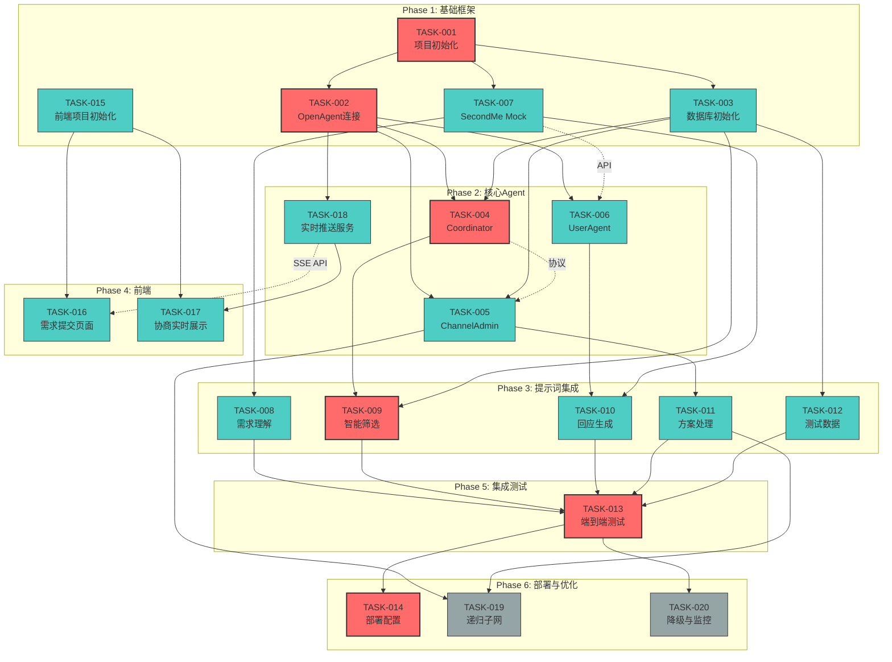

# ToWow MVP 项目计划 - v1

> 文档路径：`/docs/proj/PROJ-TOWOW-MVP-v1.md`
>
> * 文档状态：正式执行版
> * 版本：v1
> * Epic ID：TOWOW-MVP
> * 项目经理：proj
> * 创建日期：2026-01-21
> * 更新日期：2026-01-21
> * 当前时间基线：2026年1月21日 22:15 CST
> * beads 数据库：已初始化（14个任务，20个依赖关系）
> * 关联文档：
>   * tech：`../tech/TECH-TOWOW-MVP-v1.md`
>   * tasks：`../tasks/TASK-*.md`
>   * 补充文档：`../tech/TECH-TOWOW-MVP-v1-supplement-*.md`

---

## 1. 项目概述

* **项目名称**：ToWow MVP - 基于OpenAgent的多Agent协作网络
* **业务目标**：构建一个AI代理协作网络，让用户通过SecondMe（数字分身）发起需求，系统智能匹配并通过多Agent协商形成合作方案
* **关键指标**：
  * 2000人同时在线不崩溃
  * 100个真实用户发起/响应需求
  * 观众实时看到协商过程（流式）
  * 至少一个触发子网递归的案例
* **目标上线日期**：2026年2月1日（2000人演示）

## 2. 范围说明

### 2.1 本期包含的功能

| 模块 | 功能点 | 优先级 |
|------|--------|--------|
| 基础框架 | 项目初始化、OpenAgent连接、数据库初始化 | P0 |
| 核心Agent | Coordinator、ChannelAdmin、UserAgent、SecondMe Mock | P0 |
| 提示词集成 | 需求理解、智能筛选、回应生成、方案处理 | P0 |
| 前端系统 | 需求提交页面、协商实时展示、SSE实时推送 | P0 |
| 演示准备 | 测试数据准备、端到端测试、部署配置 | P0 |
| 高级功能 | 递归子网实现 | P1 |
| 稳定性 | 降级预案与监控 | P1 |

### 2.2 Out of Scope（本期不包含）

* SecondMe 真实对接（使用 Mock）
* 用户认证与权限系统
* 数据持久化与备份策略
* 多语言支持
* 移动端适配

## 3. Story -> Slice -> Task 对齐表

> 由于本项目采用技术驱动的任务拆分（基于TECH文档），以下为技术模块到任务的对齐表。

| 模块 | TASK_ID 列表 | 本期纳入 | 验收责任人 | 备注 |
|------|-------------|---------|-----------|------|
| 基础框架 | TASK-001, TASK-002, TASK-003 | YES | tech | 项目骨架，P0 |
| 核心Agent | TASK-004, TASK-005, TASK-006, TASK-007 | YES | tech | Agent实现，P0 |
| 提示词集成 | TASK-008, TASK-009, TASK-010, TASK-011 | YES | tech | LLM集成，P0 |
| 演示准备 | TASK-012, TASK-013, TASK-014 | YES | tech + prd | 端到端验收，P0 |
| 前端系统 | TASK-015, TASK-016, TASK-017, TASK-018 | YES | prd | 用户界面，P0 |
| 高级功能 | TASK-019 | YES | tech | 递归子网，P1 |
| 稳定性 | TASK-020 | YES | tech | 降级监控，P1 |

## 4. beads 任务 ID 映射表

> 所有任务状态以 beads 为准。使用 `bd show <beads_id>` 查看任务详情。

| TASK ID | Beads ID | 优先级 | 状态 |
|---------|----------|--------|------|
| TASK-001 | towow-9do | P0 | open |
| TASK-002 | towow-28h | P0 | open |
| TASK-003 | towow-aej | P0 | open |
| TASK-004 | towow-ahl | P0 | open |
| TASK-005 | towow-lyc | P0 | open |
| TASK-006 | towow-5fm | P0 | open |
| TASK-007 | towow-a10 | P0 | open |
| TASK-008~014 | towow-j5b | P0 | open |
| TASK-015 | towow-aie | P0 | open |
| TASK-016 | towow-7hf | P0 | open |
| TASK-017 | towow-lab | P0 | open |
| TASK-018 | towow-kdy | P0 | open |
| TASK-019 | towow-e2b | P1 | open |
| TASK-020 | towow-dq8 | P1 | open |

**Ready 任务**（无阻塞，可立即开始）：
- `towow-9do` TASK-001: 项目初始化
- `towow-aie` TASK-015: 前端项目初始化

## 5. 执行进度表

> 状态约定：`TODO` / `DOING` / `BLOCKED` / `DONE`
> 当 beads 系统启用后，状态以 beads 为准

| TASK_ID | 标题 | 优先级 | Owner | 状态 | 预计工时 | 硬依赖 | 证据链接 |
|---------|------|--------|-------|------|---------|--------|---------|
| TASK-001 | 项目初始化 | P0 | dev | TODO | 4h | - | `../tasks/TASK-001-项目初始化.md` |
| TASK-002 | OpenAgent连接 | P0 | dev | TODO | 8h | TASK-001 | `../tasks/TASK-002-OpenAgent连接.md` |
| TASK-003 | 数据库初始化 | P0 | dev | TODO | 6h | TASK-001 | `../tasks/TASK-003-数据库初始化.md` |
| TASK-004 | Coordinator实现 | P0 | dev | TODO | 12h | TASK-002, TASK-003 | `../tasks/TASK-004-Coordinator实现.md` |
| TASK-005 | ChannelAdmin实现 | P0 | dev | TODO | 12h | TASK-002, TASK-003 | `../tasks/TASK-005-ChannelAdmin实现.md` |
| TASK-006 | UserAgent实现 | P0 | dev | TODO | 8h | TASK-002 | `../tasks/TASK-006-UserAgent实现.md` |
| TASK-007 | SecondMe Mock | P0 | dev | TODO | 8h | TASK-001 | `../tasks/TASK-007-SecondMe-Mock.md` |
| TASK-008 | 需求理解集成 | P0 | dev | TODO | 4h | TASK-007 | `../tasks/TASK-008-014-提示词与演示.md` |
| TASK-009 | 智能筛选集成 | P0 | dev | TODO | 4h | TASK-004, TASK-003 | `../tasks/TASK-008-014-提示词与演示.md` |
| TASK-010 | 回应生成集成 | P0 | dev | TODO | 4h | TASK-006, TASK-007 | `../tasks/TASK-008-014-提示词与演示.md` |
| TASK-011 | 方案处理集成 | P0 | dev | TODO | 6h | TASK-005 | `../tasks/TASK-008-014-提示词与演示.md` |
| TASK-012 | 测试数据准备 | P0 | dev | TODO | 4h | TASK-003 | `../tasks/TASK-008-014-提示词与演示.md` |
| TASK-013 | 端到端测试 | P0 | dev | TODO | 8h | TASK-008~012 | `../tasks/TASK-008-014-提示词与演示.md` |
| TASK-014 | 部署配置 | P0 | dev | TODO | 8h | TASK-013 | `../tasks/TASK-008-014-提示词与演示.md` |
| TASK-015 | 前端项目初始化 | P0 | dev | TODO | 4h | - | `../tasks/TASK-015-前端项目初始化.md` |
| TASK-016 | 需求提交页面 | P0 | dev | TODO | 8h | TASK-015 | `../tasks/TASK-016-需求提交页面.md` |
| TASK-017 | 协商实时展示 | P0 | dev | TODO | 12h | TASK-015, TASK-018 | `../tasks/TASK-017-协商过程实时展示.md` |
| TASK-018 | 实时推送服务 | P0 | dev | TODO | 10h | TASK-002 | `../tasks/TASK-018-实时推送服务.md` |
| TASK-019 | 递归子网实现 | P1 | dev | TODO | 12h | TASK-005, TASK-011 | `../tasks/TASK-019-递归子网实现.md` |
| TASK-020 | 降级与监控 | P1 | dev | TODO | 10h | TASK-013 | `../tasks/TASK-020-降级预案与监控.md` |

**总计**：20个任务，约142工时

## 5. 任务依赖关系

### 5.1 依赖类型定义

| 类型 | 定义 | 处理规则 |
|------|------|---------|
| **硬依赖** | 代码直接 import 了其他任务的模块 | 禁止 mock，必须等实现完成，设置 beads 依赖 |
| **接口依赖** | 只需要调用接口，不依赖具体实现 | 契约先行，可并行开发，不设置 beads 依赖 |

### 5.2 完整依赖矩阵

| TASK ID | 任务名称 | 硬依赖 | 接口依赖 | 可并行任务 |
|---------|---------|--------|---------|-----------|
| TASK-001 | 项目初始化 | - | - | TASK-015 |
| TASK-002 | OpenAgent连接 | TASK-001 | - | TASK-003 |
| TASK-003 | 数据库初始化 | TASK-001 | - | TASK-002 |
| TASK-004 | Coordinator实现 | TASK-002, TASK-003 | - | TASK-005, TASK-006 |
| TASK-005 | ChannelAdmin实现 | TASK-002, TASK-003 | TASK-004(协议) | TASK-004, TASK-006 |
| TASK-006 | UserAgent实现 | TASK-002 | TASK-007(SecondMe API) | TASK-004, TASK-005 |
| TASK-007 | SecondMe Mock | TASK-001 | - | TASK-002~006 |
| TASK-008 | 需求理解集成 | TASK-007 | - | TASK-009~011 |
| TASK-009 | 智能筛选集成 | TASK-004, TASK-003 | - | TASK-008, 010, 011 |
| TASK-010 | 回应生成集成 | TASK-006, TASK-007 | - | TASK-008, 009, 011 |
| TASK-011 | 方案处理集成 | TASK-005 | - | TASK-008~010 |
| TASK-012 | 测试数据准备 | TASK-003 | - | TASK-004~011 |
| TASK-013 | 端到端测试 | TASK-008~012 | - | - |
| TASK-014 | 部署配置 | TASK-013 | - | TASK-019, 020 |
| TASK-015 | 前端项目初始化 | - | - | TASK-001~007 |
| TASK-016 | 需求提交页面 | TASK-015 | TASK-018(SSE API) | TASK-017 |
| TASK-017 | 协商实时展示 | TASK-015, TASK-018 | - | - |
| TASK-018 | 实时推送服务 | TASK-002 | - | TASK-015~017 |
| TASK-019 | 递归子网实现 | TASK-005, TASK-011 | - | TASK-020 |
| TASK-020 | 降级与监控 | TASK-013 | - | TASK-019 |

### 5.3 依赖关系图（Mermaid）



### 5.4 关键路径

关键路径决定了项目最短完成时间：

```
TASK-001 (4h)
    -> TASK-002 (8h)
        -> TASK-004 (12h)
            -> TASK-009 (4h)
                -> TASK-013 (8h)
                    -> TASK-014 (8h)

总计：44h（关键路径）
```

**次关键路径**：
```
TASK-001 -> TASK-003 -> TASK-005 -> TASK-011 -> TASK-013
TASK-001 -> TASK-002 -> TASK-018 -> TASK-017
```

### 5.5 beads 依赖设置命令

> 注意：以下命令需要在 beads 任务创建后执行。当前 beads 中没有任务，需要先通过 `/vibedevteam:init` 创建任务。

```bash
# Phase 1: 基础框架
bd dep add TASK-002 TASK-001
bd dep add TASK-003 TASK-001
bd dep add TASK-007 TASK-001

# Phase 2: 核心Agent
bd dep add TASK-004 TASK-002
bd dep add TASK-004 TASK-003
bd dep add TASK-005 TASK-002
bd dep add TASK-005 TASK-003
bd dep add TASK-006 TASK-002
bd dep add TASK-018 TASK-002

# Phase 3: 提示词集成
bd dep add TASK-008 TASK-007
bd dep add TASK-009 TASK-004
bd dep add TASK-009 TASK-003
bd dep add TASK-010 TASK-006
bd dep add TASK-010 TASK-007
bd dep add TASK-011 TASK-005
bd dep add TASK-012 TASK-003

# Phase 4: 前端
# TASK-015 无依赖，可独立开始
bd dep add TASK-016 TASK-015
bd dep add TASK-017 TASK-015
bd dep add TASK-017 TASK-018

# Phase 5: 集成测试
bd dep add TASK-013 TASK-008
bd dep add TASK-013 TASK-009
bd dep add TASK-013 TASK-010
bd dep add TASK-013 TASK-011
bd dep add TASK-013 TASK-012

# Phase 6: 部署与优化
bd dep add TASK-014 TASK-013
bd dep add TASK-019 TASK-005
bd dep add TASK-019 TASK-011
bd dep add TASK-020 TASK-013
```

### 5.6 接口依赖验证约定

| 被依赖任务 | 接口依赖任务 | 接口契约 | 验证时间点 |
|-----------|-------------|---------|-----------|
| TASK-004 | TASK-005 | Agent消息协议 | TASK-004完成后 |
| TASK-007 | TASK-006 | SecondMe API | TASK-007完成后 |
| TASK-018 | TASK-016 | SSE Event Format | TASK-018完成后 |

## 6. 时间计划与里程碑

### 6.1 时间线

| 里程碑 | 目标日期 | 包含任务 | 完成定义 |
|--------|---------|---------|---------|
| M1 | 2026-01-24 | TASK-001~003, 007, 015 | 基础框架可运行，Agent可连接 |
| M2 | 2026-01-27 | TASK-004~006, 016, 018 | 核心Agent实现，前端骨架完成 |
| M3 | 2026-01-29 | TASK-008~012, 017 | 提示词集成完成，前端可展示 |
| M4 | 2026-01-31 | TASK-013, 019, 020 | 端到端测试通过，高级功能完成 |
| M5 | 2026-02-01 | TASK-014 | 部署上线，演示就绪 |

### 6.2 里程碑完成定义（DoD）

**M1 - 基础框架就绪（2026-01-24）**
- [ ] 项目结构初始化完成，依赖可安装
- [ ] OpenAgent 连接成功，可发送/接收消息
- [ ] PostgreSQL 表结构创建完成，可读写
- [ ] SecondMe Mock 服务启动，API 可调用
- [ ] 前端项目初始化完成，开发服务器可启动

**M2 - 核心Agent完成（2026-01-27）**
- [ ] Coordinator 可接收需求、广播、筛选候选人
- [ ] ChannelAdmin 可管理协商Channel、收集回应
- [ ] UserAgent 可代表用户参与协商
- [ ] SSE 实时推送服务可工作
- [ ] 需求提交页面可提交需求

**M3 - 提示词集成完成（2026-01-29）**
- [ ] 需求理解提示词集成到SecondMe Mock
- [ ] 智能筛选提示词集成到Coordinator
- [ ] 回应生成提示词集成到UserAgent
- [ ] 方案处理提示词集成到ChannelAdmin
- [ ] 100个测试Agent数据准备完成
- [ ] 协商实时展示页面可展示完整流程

**M4 - 集成测试完成（2026-01-31）**
- [ ] 端到端测试覆盖完整协商流程
- [ ] 递归子网功能可触发
- [ ] 降级预案和监控配置完成
- [ ] 2000并发压力测试通过

**M5 - 演示就绪（2026-02-01）**
- [ ] 生产环境部署完成
- [ ] 演示脚本准备完成
- [ ] 回滚方案验证完成

## 7. 资源配置

### 7.1 团队配置

| 角色 | 人数 | 投入时间 | 主要职责 |
|------|------|----------|----------|
| 后端开发 | 2 | 全职 | TASK-001~014, 018~020 |
| 前端开发 | 1 | 全职 | TASK-015~017 |
| 测试 | 1 | 兼职(50%) | TASK-012, 013 |
| 项目管理 | 1 | 兼职(30%) | 进度跟踪、风险管理 |

### 7.2 无限 AI Dev 场景执行计划

当有大量 AI dev 可用时，基于硬依赖关系的并行策略：

**第一批（立即可并行）** - Day 1
- TASK-001: 项目初始化
- TASK-015: 前端项目初始化

**第二批（等TASK-001）** - Day 2
- TASK-002: OpenAgent连接
- TASK-003: 数据库初始化
- TASK-007: SecondMe Mock

**第三批（等TASK-002/003）** - Day 3-4
- TASK-004: Coordinator实现
- TASK-005: ChannelAdmin实现
- TASK-006: UserAgent实现
- TASK-018: 实时推送服务
- TASK-016: 需求提交页面（等TASK-015）
- TASK-012: 测试数据准备（等TASK-003）

**第四批（等第三批）** - Day 5-6
- TASK-008: 需求理解集成（等TASK-007）
- TASK-009: 智能筛选集成（等TASK-004, 003）
- TASK-010: 回应生成集成（等TASK-006, 007）
- TASK-011: 方案处理集成（等TASK-005）
- TASK-017: 协商实时展示（等TASK-015, 018）

**第五批（等第四批）** - Day 7-8
- TASK-013: 端到端测试（等TASK-008~012）

**第六批（等TASK-013）** - Day 9-10
- TASK-014: 部署配置
- TASK-019: 递归子网实现（等TASK-005, 011）
- TASK-020: 降级与监控

**总计**：最快10个工作日完成

## 8. 风险管理

### 8.1 技术风险

| 风险 | 概率 | 影响 | 预案 |
|------|------|------|------|
| OpenAgent API不稳定 | 中 | 高 | 提前测试、准备HTTP降级方案 |
| LLM响应慢 | 中 | 中 | 超时设置(30s)、异步处理、缓存机制 |
| 2000人并发问题 | 低 | 高 | 压力测试、限流机制、演示模式 |
| SecondMe对接延期 | 高 | 中 | Mock服务完整实现、可独立演示 |

### 8.2 业务风险

| 风险 | 概率 | 影响 | 预案 |
|------|------|------|------|
| 匹配质量差 | 中 | 高 | 提示词优化、人工兜底选项 |
| 协商时间过长 | 中 | 中 | 超时机制(5分钟)、妥协方案自动生成 |
| 演示效果不佳 | 低 | 高 | 预设演示场景、种子数据、演示模式 |

### 8.3 变更管理

* 范围变更：需项目经理确认，更新本文档并通知相关方
* 排期变更：需评估对关键路径影响，更新里程碑
* 技术变更：需tech确认，更新TECH文档和相关TASK

## 9. Gate 检查点（强护栏）

### 9.1 Gate A - 进入实现前（已通过）

- [x] TECH-TOWOW-MVP-v1.md 完成
- [x] 任务拆分完成（20个TASK）
- [x] 依赖关系分析完成
- [x] 补充文档完成（5个supplement）

### 9.2 Gate B - P0 Task 进入 DONE 前

每个P0 Task必须具备：
- [ ] 对应AC的测试用例与结果
- [ ] 至少一次"真数据真流程"的端到端验证
- [ ] 回滚方案 + 上线观测点

### 9.3 Gate C - 发生方向偏差时

触发条件：
- 发现"不是想要的"或关键分叉决策改变
- 技术方案不可行需要重大调整

必须动作：
- TECH/PROJ 升版本并记录变更点
- 受影响的 TASK 必须重排

## 10. 验收与上线门槛（Release Gate）

### 10.1 验收负责人与方式

* 验收负责人：prd + tech
* 验收方式：端到端演示 + 压力测试
* 验收环境：阿里云ECS测试环境

### 10.2 必过清单（上线前）

- [ ] 所有P0任务完成（状态为DONE）
- [ ] 端到端测试覆盖完整流程
- [ ] 2000并发压力测试通过
- [ ] 降级预案验证完成
- [ ] 监控告警配置完成
- [ ] 回滚方案验证完成
- [ ] 演示脚本准备完成

### 10.3 禁止 Mock 检查点

- [ ] 前端是否调用真实后端API？
- [ ] 后端是否返回真实数据结构？
- [ ] 是否进行了真数据端到端验证？

## 11. 提交流程（生命线）

### 11.1 标准 dev 调度指令模板

每次调度 dev 时使用以下模板：

```markdown
@agent-dev

任务：TASK-XXX 任务标题

【依赖状态】
[ ] 上游任务状态

【任务要求】
（具体任务描述）

【提交流程（重要！必须遵守）】

1. 完成代码 + 更新 TASK 文档
2. 标记 beads 状态为 `DOING`
3. 停止！不要 commit！
4. 通知 proj 安排 tech review
5. 等待 tech review 通过
6. review 通过后，执行 Git Commit（引用 TASK-ID）
7. 标记 beads 状态为 `DONE`

违反流程的后果：代码需要重新 review，可能需要返工

【输出】
1. 代码实现
2. 更新 TASK-XXX 文档
3. 自测验证
```

## 12. 沟通机制

* **每日站会**：15分钟，同步进度和阻塞点
* **里程碑Review**：每个里程碑完成后进行回顾
* **风险升级**：发现风险立即报告项目经理

## 13. 变更记录（Changelog）

| 版本 | 日期 | 修改人 | 修改内容 |
|------|------|--------|----------|
| v1.0 | 2026-01-21 | proj | 初版：基于TECH文档创建项目计划 |
| v1.1 | 2026-01-21 | proj | 初始化 beads 数据库，创建14个任务，设置20个依赖关系 |

---

**当前状态**：

- beads 数据库已初始化
- 14个任务已创建（TASK-008~014 合并为一个任务）
- 20个硬依赖关系已设置
- 2个任务可立即开始：TASK-001 (towow-9do), TASK-015 (towow-aie)

**下一步行动**：

1. 开始执行第一批任务：
   - `bd update towow-9do -s doing` 然后开发 TASK-001
   - `bd update towow-aie -s doing` 然后开发 TASK-015
2. 使用 `/vibedevteam:sync` 同步进度到本文档
